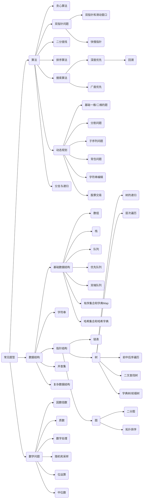
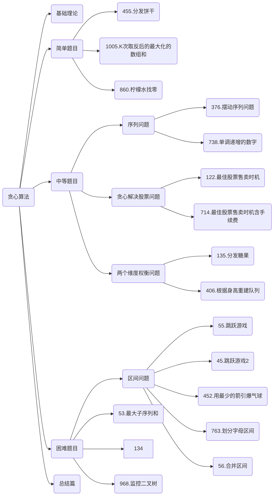

## 一、刷题时间表

* ***[2021.10.27-difficult:301.移除无效的括号](#301)**
* **[2021.10.28-mid:869. 重新排序得到 2 的幂](#869)**
* **[*2021.10.29-difficult:335.路径交叉](#335)**
* **[2021.10.30-mid:260.只出现一次的数字3](#260)**
* **[2021.10.31-easy: 500.键盘行](#500)**
* **[2021.11.1-easy:575.分糖果](#575)**
* **[2021.11.2 - easy: 237.删除链表中的节点](#237)**
* **[2021.11.3-difficult: 407.接雨水2](#407)**
* **[2021.11.4-easy:367有效的完全平方](#367)**
* **[2021.11.5-mid: 1218.最长定差子序列](#1218)**
* **[2021.11.6-easy：268.只出现一次的数字](#268)**
* **[2021.11.7-easy: 598.范围求和](#598)**
* **[2021.11.8-mid: 299.猜数字游戏](#299)**
* ***[2021.11.9-difficult: 488 ZumaGame](#488)**
* **[2021.11.10-easy: 495.TeemoAttacking](#495)**
* ***[2021.11.11-difficult: 629.KInversePairs](#629)**
* ***[2021.11.12-mid: 375.Guess number higher or lower2](#375)**
* **[2021.11.13-easy: 520.DetectCapital](#520)**
* **[2021.11.14-mid: 677. Map Sum Pairs](#677)**
* **[2021.11.15-mid: 319.bulb-switcher](#319)**
* **[*2021.11.16-difficult:391.PerfectRectangle](#391)**
* **[2021.11.17-mid: 318.MaxmumProductOfWordLengths](#318)**
* **[2021.11.18-easy:563.BinaryTreeTilt](#563)**
* **[2021.11.19-mid:397.IntegerReplacement](#397)**
* **[2021.11.20-easy:594.LongestHarmoniousSubsequence](#594)**
* **[2021.11.21-easy:559.MaxmumDepthOfNAryTree](#559)**
* **[2021.11.22-mid:384.ShuffleAnArray](#384)**
* **[2021.11.23-easy: 859.BuddyStrings](#859)**
* **[2021.11.24-mid:423.reconstruct-original-digits-from-english](#423)**
* **[2021.11.25-difficult:458.PoorPig](#458)**
* **[2021.11.26-mid:519.RandomFlipMatrix](#519)**

## 二、刷题 分类表



### 1.算法

#### 1.1.贪心算法




| 刷题时间   | 题目                         | 难度 | 思路        | 链接                                                         |
| ---------- | ---------------------------- | ---- | ----------- | ------------------------------------------------------------ |
| 2021.11.27 | 455.分发饼干                 | easy | [go](#455)  | [455.分发饼干](https://leetcode-cn.com/problems/assign-cookies/) |
| 2021.11.27 | 1005.k次取反后最大化的数组和 | easy | [go](#1005) | [1005.K次取反后最大化的数组和](https://leetcode-cn.com/problems/maximize-sum-of-array-after-k-negations) |
| 2021.11.27 | 860.柠檬水找零               | easy | [go](#860)  | [860.柠檬水找零](https://leetcode-cn.com/problems/lemonade-change/) |


#### 1.2. 双指针

##### 1.2.1.双指针和滑动窗口

##### 1.2.2.快慢指针

#### 1.3.二分查找

#### 1.4.各种排序

#### 1.5.搜索算法

#### 1.6.动态规划

#### 1.7.分支和递归

### 2.数据结构

#### 2.1. 字符串

#### 2.2.链表

#### 2.3.树

#### 2.4.图

#### 2.5.复杂数据结构

### 3.数学

#### 3.1. 因数倍数

#### 3.2. 质数

#### 3.3 数字处理

#### 3.4. 随机和采样

#### 3.5 位运算

#### 3.6. 中位数

## 三、逐题题解

### <span id="237">237.删除链表中的节点 easy</span>

#### 题目描述

请编写一个函数，用于 删除单链表中某个特定节点 。在设计函数时需要注意，你无法访问链表的头节点 head ，只能直接访问 要被删除的节点 。

题目数据保证需要删除的节点 不是末尾节点 。

 .assets/node1.jpg)

```
示例1：
输入：head = [4,5,1,9], node = 5
输出：[4,1,9]
解释：指定链表中值为 5 的第二个节点，那么在调用了你的函数之后，该链表应变为 4 -> 1 -> 9
```

.assets/node2.jpg)

```
示例2
输入：head = [4,5,1,9], node = 1
输出：[4,5,9]
解释：指定链表中值为 1 的第三个节点，那么在调用了你的函数之后，该链表应变为 4 -> 5 -> 9
示例 3：

输入：head = [1,2,3,4], node = 3
输出：[1,2,4]
示例 4：

输入：head = [0,1], node = 0
输出：[1]
示例 5：

输入：head = [-3,5,-99], node = -3
输出：[5,-99]
```

**提示：**

链表中节点的数目范围是 [2, 1000]
-1000 <= Node.val <= 1000
链表中每个节点的值都是唯一的
需要删除的节点 node 是 链表中的一个有效节点 ，且 不是末尾节点

##### 思路

用当前节点的后一个节点覆盖当前节点的值，依次，最后删掉最后一个节点。

#### 代码

```java
package cn.edu.csust.leetcode;
/**
 * Definition for singly-linked list.
 * public class ListNode {
 *     int val;
 *     ListNode next;
 *     ListNode(int x) { val = x; }
 * }
 */
class ListNode {
    int val;
    ListNode next;
    ListNode(int x) { val = x; }
}
class Solution {
    public void deleteNode1(ListNode node) {
        while(node.next.next != null){
            node.val = node.next.val;
            node = node.next;
        }
        node.val = node.next.val;
        node.next = null;
    }
    public void deleteNode2(ListNode node) {
        while(node.next.next != null){
            node.val = node.next.val;
            node = node.next;
        }
        node.val = node.next.val;
        node.next = node.next.next;
    }
}
```


#### 提交结果成绩

.assets/image-20211102082502448.png)

### <span id="260">260.SingleNumber3</span>

#### 题目描述

> 给定一个整数数组 nums，其中恰好有两个元素只出现一次，其余所有元素均出现两次。 找出只出现一次的那两个元素。你可以按 任意顺序 返回答案。


```
示例 1：
输入：nums = [1,2,1,3,2,5]
输出：[3,5]
解释：[5, 3] 也是有效的答案。
示例 2：

输入：nums = [-1,0]
输出：[-1,0]
示例 3：

输入：nums = [0,1]
输出：[1,0]
```

**提示：**

$2 <= nums.length <= 3 * 10^4$
$-2^{31} <= nums[i] <= 2^{31} - 1$

#### 解题思路

遍历第一遍，将所有的数都进行一个异或，得到最后结果的最高位，

再次遍历数组，与最高位进行与操作，如果不为0的，那么这些数必定存在一个单数，

如果为0，那么这些数也存在另一个单数，分成两组遍历

#### 代码

```java
class Solution{
    public int[] singleNumber(int [] nums){
        if(nums.length == 2){
            return nums;
        }
        int sum = 0;
        int [] res = new int[2];
        for (int num: nums) {
            sum ^= num;
        }
        int len = 1;
        while((sum & 1) == 0) {
            sum >>= 1;
            len <<= 1;
        }
        for (int num: nums) {
            if((num & len) != 0){
                res[0] ^= num;
            }
            else{
                res[1] ^= num;
            }
        }
        return res;
    }
}
```

```
时间beats:100%
空间beats:38%
```

### <span id="268">268. Missing Number</span>

#### 题目描述

> 给定一个包含 [0, n] 中 n 个数的数组 nums ，找出 [0, n] 这个范围内没有出现在数组中的那个数。

**示例输入**

 ```
 示例 1：
 
 输入：nums = [3,0,1]
 输出：2
 解释：n = 3，因为有 3 个数字，所以所有的数字都在范围 [0,3] 内。2 是丢失的数字，因为它没有出现在 nums 中。
 示例 2：
 
 输入：nums = [0,1]
 输出：2
 解释：n = 2，因为有 2 个数字，所以所有的数字都在范围 [0,2] 内。2 是丢失的数字，因为它没有出现在 nums 中。
 示例 3：
 
 输入：nums = [9,6,4,2,3,5,7,0,1]
 输出：8
 解释：n = 9，因为有 9 个数字，所以所有的数字都在范围 [0,9] 内。8 是丢失的数字，因为它没有出现在 nums 中。
 示例 4：
 
 输入：nums = [0]
 输出：1
 解释：n = 1，因为有 1 个数字，所以所有的数字都在范围 [0,1] 内。1 是丢失的数字，因为它没有出现在 nums 中。
 ```

**提示**：

$n == nums.length$
$1 <= n <= 10^4$
$0 <= nums[i] <= n$
nums 中的所有数字都 独一无二

**进阶**：你能否实现线性时间复杂度、仅使用额外常数空间的算法解决此问题?

#### 思路

##### 1.思路一：

开辟n + 1个空间，用哈希，如果哪一个空间没有被占用那么返回该值

##### 2.思路二：

原地空间，如果num[num[i]] != num[i],就交换

再次遍历查找如果num[i] != i返回，否则返回nums.length;

##### 3.思路三：

遍历前首先做异或从0-n,做num[i]的异或，返回异或结果

#### 代码

```java
package cn.edu.csust.leetcode.Array;

import java.util.Arrays;

class Solution {
//    开辟空间
//    执行结果：通过
//    执行用时：0 ms, 在所有 Java 提交中击败了100.00%的用户
//    内存消耗：38.4 MB, 在所有 Java 提交中击败了96.43%的用户
    public int missingNumber(int[] nums) {
        int [] temp = new int [nums.length+1];
        for (int num : nums) {
            temp[num] = 1;
        }
        for (int i = 0; i <= nums.length; i++) {
            if(temp[i] == 0)
                return i;
        }
        return 0;
    }
    //    原地空间
//    慢
//    时间beats:41.56%
//    空间beats:84.49%
    public int missingNumber2(int[] nums) {
        int n  = nums.length;
        for (int i = 0; i < n; i++) {
            while(nums[i] < n && nums[nums[i]] != nums[i]){
                int temp = nums[i];
                nums[i] = nums[temp];
                nums[temp] = temp;
            }
        }
        for (int i = 0; i < nums.length; i++) {
            if(nums[i] != i)
                return i;
        }
        return n;
    }
//    异或：常量空间

    public int missingNumber3(int [] nums){
        int sum = 0;
        int n = nums.length;
        for (int i = 0; i <= n; i++) {
            sum ^= i;
            if(i < n)
                sum ^= nums[i];
        }
        return sum;
    }
}
public class MissingNumber {
    public static void main(String[] args) {
        Solution solution = new Solution();
        System.out.println(solution.missingNumber2(new int[]{3,0,1}));
    }
}

```

.assets/image-20211106084910089.png)

### <span id="299">299.BullsAndCows</span>

#### 题目描述:

你在和朋友一起玩 猜数字（Bulls and Cows）游戏，该游戏规则如下：

写出一个秘密数字，并请朋友猜这个数字是多少。朋友每猜测一次，你就会给他一个包含下述信息的提示：

猜测数字中有多少位属于数字和确切位置都猜对了（称为 "Bulls", 公牛），
有多少位属于数字猜对了但是位置不对（称为 "Cows", 奶牛）。也就是说，这次猜测中有多少位非公牛数字可以通过重新排列转换成公牛数字。
给你一个秘密数字 secret 和朋友猜测的数字 guess ，请你返回对朋友这次猜测的提示。

提示的格式为 "xAyB" ，x 是公牛个数， y 是奶牛个数，A 表示公牛，B 表示奶牛。

请注意秘密数字和朋友猜测的数字都可能含有重复数字。

**示例 1**:

```
输入: secret = "1807", guess = "7810"
输出: "1A3B"
解释: 数字和位置都对（公牛）用 '|' 连接，数字猜对位置不对（奶牛）的采用斜体加粗标识。
"1807"
  |
"7810"
```

**示例 2:**

```
输入: secret = "1123", guess = "0111"
输出: "1A1B"
解释: 数字和位置都对（公牛）用 '|' 连接，数字猜对位置不对（奶牛）的采用斜体加粗标识。
"1123"        "1123"
  |      or     |
"0111"        "0111"
注意，两个不匹配的 1 中，只有一个会算作奶牛（数字猜对位置不对）。通过重新排列非公牛数字，其中仅有一个 1 可以成为公牛数字。
```

**示例 3：**

```
输入：secret = "1", guess = "0"
输出："0A0B"
示例 4：

输入：secret = "1", guess = "1"
输出："1A0B"
```

**提示**：

$1 <= secret.length, guess.length <= 1000$
$secret.length == guess.length$
secret 和 guess 仅由数字组成

#### 思路：

* **相同的字符串统计countA,不同的字符统计 每个数字0-9在guess和secret中的最小次数，即为位置不正确但是数字正确的数量**

#### 代码:

```java
//思路：
class Solution {
    public String getHint(String secret, String guess) {
        int[] nums = new int[10];
        int countA = 0, countB = 0;
        for (int i = 0; i < secret.length(); i++) {
            if(secret.charAt(i) == guess.charAt(i)) countA++;
            else{
                if (nums[guess.charAt(i) - '0']-- > 0) countB++;
                if(nums[secret.charAt(i) - '0']++ < 0) countB++;
            }
        }
        return countA + "A" + countB + "B";
    }
    public String getHint(String secret, String guess) {
        int countA = 0;
        int countB = 0;
        Map<Character, Integer> map = new HashMap<>();
        List<Character> list = new ArrayList<>();
        for (int i = 0; i < secret.length(); i++) {
            char charSecret = secret.charAt(i);
            char charGuess = guess.charAt(i);
            if(charSecret == charGuess){
                countA++;
            }
            else{
                list.add(charGuess);
                map.put(charSecret, map.getOrDefault(charSecret, 0) + 1);
            }
        }
        for (int i = 0; i < list.size(); i++) {
            char charGuess = list.get(i);
            if(map.getOrDefault(charGuess, 0) > 0){
                map.put(charGuess, map.get(charGuess) - 1);
                if(map.get(charGuess) == 0){
                    map.remove(charGuess);
                }
                countB++;
            }
        }
        return countA + "A" + countB + "B";
    }
}
```

.assets/image-20211108150005629.png)

### <span id="301">301. Remove Invalid Parentheses</span>

* **方法1: backtracking/dfs**
* **易错点**
* **方法2: bfs**

> **```Remove the minimum number of invalid parentheses in order to make the input string valid. Return all possible results.```**
> ==**Note: The input string may contain letters other than the parentheses ( and ).**==

**Example 1:**

```
Input: "()())()"
Output: ["()()()", "(())()"]
```


**Example 2:**

```
Input: "(a)())()"
Output: ["(a)()()", "(a())()"]
```

**Example 3:**

```
Input: ")("
Output: [""]
```

#### 方法1: dfs
**思路**：

遍历第一遍统计有多少个非法的“(”，以及非法的“)”，赋值为 l 和 r，也就是交给dfs需要删除的括号数量。
开始dfs。在dfs的过程中，退出条件是l = 0 && r == 0，此时可以合法推入一个结果。如果还没有删完，需要遍历字串，尝试删除一个"(“或”)"（看哪个还需要）。这个过程中可以用到技巧剪枝：1. 如果当前的i不是"(“或”)"，可以跳过， 2， 对于有多种删除选择但是导致的结果相同时，我们选择跳过。这种情况仅发生在类似“())”或"((" 这种情况，也就是出现多个重复的左右括号。那么为了减掉这些可以通过 if (i != start && s[i] == s[i - 1]) continue。start是每次dfs传递进来的string需要开始尝试删除的位置。为什么记录这个呢？因为这个值之前的字符如果需要我们都已经尝试过删除了，再从头开始会产生很多重复计算。而且利用这个数字也可以来去重。删除的操作是s.erase(i, 1)去掉这个字符。注意这时的start就会移交给 i，因为之前的我们也在本循环内都递归删除过了。

##### code

```java
package cn.edu.csust.leetcode.stack;

import java.util.*;
// DFS
//1.这个题可以用堆栈，
// 但是由于只有小括号，
// 所以堆栈有点多余，
// 直接用一个统计变量统计是否有不匹配的左右括号即可
class Solution {
//    检测右括号检测是否多余
    char[] pair = new char[]{'(', ')'};
    char[] rePair = new char[]{')', '('};
    public List<String> removeInvalidParentheses(String s) {
        List<String> result = new ArrayList<>();
        removeHelper(s, result, 0, 0, pair);
        return result;
    }
    private void removeHelper(String s, List<String> result, int lastI, int lastJ, char [] pa){
//        count用于记录有多少个不合法括号，count>0,左括号不合法，count < 0右括号不合法
        int count = 0;
        for (int i = lastI; i < s.length(); i++) {
            if(s.charAt(i) == pa[0]){
                count++;
            }
            if(s.charAt(i) == pa[1]){
                count--;
            }
            if(count<0){
                for (int j = lastJ; j <= i; j++) {
                    if(s.charAt(j) == pa[1] && (j == lastJ||s.charAt(j - 1) != pa[1])){
                        String newStr = s.substring(0, j) + s.substring(j + 1);
                        removeHelper(newStr, result, i, j, pa);
                    }
                }
                return;
            }
        }
        StringBuilder stringBuilder = new StringBuilder(s);
        stringBuilder.reverse();
        s = stringBuilder.toString();
        if(pa[0] == '('){
            removeHelper(s, result, 0, 0, rePair);
        }
        else{
            result.add(s);
        }
    }
}
// 测试类
public class RemoveInvalidParentheses {
    public static void main(String[] args) {
        Solution solution = new Solution();
        System.out.println(solution.removeInvalidParentheses("))(("));
    }
}

```


#### 易错点

* 统计非法括号的子函数易错：如果用下面列的第二种累计cnt的方法，cnt不应该出现< -1，因为)))* (((，右边的（没有immunity。
* 统计合法的时候（两次都包括）不要粗暴的else if，因为还可能有其他字符，要检查确实是“(”或者")"。
* 这里的dfs不要用&，或者像下面的方法一样用&但是单独拷贝出一个current，因为要定点再恢复current不太容易。
* start的传递：移交给 i。
* 理解为什么要给一个start：为了避免重复尝试，并且这个start是指的current的start，每一次remove过之后原地传下去都不用+1。

#### 方法二: BFS

##### code

```java
class Solution {
    public List<String> removeInvalidParentheses(String s) {
        List<String> result = new ArrayList<>();
        if (s.equals("()") || s.equals("")) {
            result.add(s);
            return result;
        }

        Deque<String> queue = new ArrayDeque<>();
        queue.offer(s);
        HashSet<String> set = new HashSet<>();  //用于存储裁剪后的元素，防止重复元素加入队列
        boolean isFound = false;    //判断是否找到了有效字符串

        while (!queue.isEmpty()) {  //队列不为空
            String curr = queue.poll();
            if (isValid(curr)) {
                result.add(curr);
                isFound = true;
            }
            if (isFound) {  //找到后不再进行裁剪
                continue;
            }
            //裁剪过程
            for (int i = 0; i < curr.length(); i++) {
                if (curr.charAt(i) == '(' || curr.charAt(i) == ')') {   //只对'('或')'进行裁剪
                    String str;
                    if (i == curr.length()-1) {
                        str = curr.substring(0, curr.length()-1);
                    } else {
                        str = curr.substring(0, i) + curr.substring(i+1);
                    }
                    if (set.add(str)) { //如果集合中还未有该字符串
                        queue.offer(str);
                    }
                }
            }
        }

        if (result.isEmpty()) {
            result.add("");
        }
        return result;
    }
    
    private static boolean isValid(String s) {
        int left = 0;
        for (int i = 0; i < s.length(); i++) {
            int curr = s.charAt(i);
            if (curr == '(') {
                left++;
            } else if (curr == ')') {
                if (left != 0) {
                    left--;
                } else {
                    return false;
                }
            }
        }
        return left == 0;
    }
}
```

### <span id="318">318.MaxmumProductOfWordLengths</span>

#### 题目描述

给定一个字符串数组 words，找到 length(word[i]) * length(word[j]) 的最大值，并且这两个单词不含有公共字母。你可以认为每个单词只包含小写字母。如果不存在这样的两个单词，返回 0。

 ```
 示例 1:
 输入: ["abcw","baz","foo","bar","xtfn","abcdef"]
 输出: 16 
 解释: 这两个单词为 "abcw", "xtfn"。
 
 示例 2:
 输入: ["a","ab","abc","d","cd","bcd","abcd"]
 输出: 4 
 解释: 这两个单词为 "ab", "cd"。
 
 示例 3:
 输入: ["a","aa","aaa","aaaa"]
 输出: 0 
 解释: 不存在这样的两个单词。
 ```

#### 思路

全是小写字母, 可以用一个32为整数表示一个word中出现的字母, 
hash[i]存放第i个单词出现过的字母, a对应32位整数的最后一位,
b对应整数的倒数第二位, 依次类推. 时间复杂度O(N^2)
判断两两单词按位与的结果, 如果结果为0且长度积大于最大积则更新

#### 题解

```java
package cn.edu.csust.leetcode;

class Solution {
    public int maxProduct(String[] words) {
        int [] hash = new int[words.length];
        int max = 0;
        for (int i = 0; i < words.length; i++) {
            for (int j = 0; j < words[i].length(); j++) {
                hash[i] |= (1 << words[i].charAt(j) - 'a');
            }
        }
        for (int i = 0; i < words.length; i++) {
            for (int j = i+1; j < words.length; j++) {
                if((hash[i] & hash[j]) == 0){
                    max = Math.max(words[i].length() * words[j].length(), max);
                }
            }
        }
        return max;
    }
}
public class MaxmumProductOfWordLengths {
    public static void main(String[] args) {
        Solution solution = new Solution();
        String [] words = new String[]{"abcw","baz","foo","bar","xtfn","abcdef"};
        System.out.println(solution.maxProduct(words));
    }
}

```


### <span id="319">319.bulb-switcher</span>

#### 题目描述

初始时有 n 个灯泡处于关闭状态。第一轮，你将会打开所有灯泡。接下来的第二轮，你将会每两个灯泡关闭一个。

第三轮，你每三个灯泡就切换一个灯泡的开关（即，打开变关闭，关闭变打开）。第 i 轮，你每 i 个灯泡就切换一个灯泡的开关。直到第 n 轮，你只需要切换最后一个灯泡的开关。

找出并返回 n 轮后有多少个亮着的灯泡。


**示例 1：**

```
输入：n = 3
输出：1 
解释：
初始时, 灯泡状态 [关闭, 关闭, 关闭].
第一轮后, 灯泡状态 [开启, 开启, 开启].
第二轮后, 灯泡状态 [开启, 关闭, 开启].
第三轮后, 灯泡状态 [开启, 关闭, 关闭]. 

你应该返回 1，因为只有一个灯泡还亮着。
示例 2：

输入：n = 0
输出：0
示例 3：

输入：n = 1
输出：1
```

**提示**：

$0 <= n <= 10^9$

#### 思路

中等题一般需要一个转换思想，所以这个题是在求n以内平方数的多少

求n轮后亮着的灯泡？
* （1）第i轮时，被切换的灯泡位置是i的倍数。
* （2）由（1）得出，对于第p个灯泡来说，只有其第“因子”轮才会切换，若其有q个因子，则最终被切换q次。因为初始状态是关闭状态，那么因子数是奇数的灯泡最终是亮着的。
* （3）只有平方数的因子个数不是成对出现，举例：4=1*4,2*2，其因子是1,2,4。
* （4）那么题目最终转化为1~n里平方数的个数，进而转化为对n开平方根，向下取整即可。

#### 代码

```java
package cn.edu.csust.leetcode;
//// 暴力和面向测试编程
//class Solution {
//    public int bulbSwitch(int n) {
//        if(n == 0)
//            return 0;
//        if(n <= 3)
//            return 1;
//        if(n == 99999999)
//            return 9999;
//        if(n == 100000000)
//            return 10000;
//        boolean[] switches = new boolean[n + 1];
//        int count = 0;
//        for (int i = 1; i <= n; i++) {
//            for(int j = i; j <= n;j += i){
//                switches[j] = !switches[j];
//            }
//            if(switches[i])
//                count++;
//        }
//        return count;
//    }
//
//}
/**
 * 初始有n个灯泡关闭
 * 第i轮的操作是每i个灯泡切换一次开关（开->闭，闭->开），即切换i的倍数位置的开关。
 * 求n轮后亮着的灯泡？
 * （1）第i轮时，被切换的灯泡位置是i的倍数。
 * （2）由（1）得出，对于第p个灯泡来说，只有其第“因子”轮才会切换，若其有q个因子，则最终被切换q次。因为初始状态是关闭状态，那么因子数是奇数的灯泡最终是亮着的。
 * （3）只有平方数的因子个数不是成对出现，举例：4=1*4,2*2，其因子是1,2,4。
 * （4）那么题目最终转化为1~n里平方数的个数，进而转化为对n开平方根，向下取整即可。
 */
class Solution {
    public int bulbSwitch(int n) {
        return (int) Math.floor(Math.sqrt(n));
    }
}
public class BulbSwitcher {
    public static void main(String[] args) {
        Solution solution = new Solution();
        System.out.println(solution.bulbSwitch(3));
    }
}

```

#### 提交记录

.assets/image-20211115091533938.png)

### <span id="335">335.路径交叉 </span>

#### 题目描述

```
给定一个含有 n 个正数的数组 x。从点 (0,0) 开始，先向北移动 x[0] 米，然后向西移动 x[1] 米，向南移动 x[2] 米，向东移动 x[3] 米，持续移动。也就是说，每次移动后你的方位会发生逆时针变化。

编写一个 O(1) 空间复杂度的一趟扫描算法，判断你所经过的路径是否相交。

 

示例 1:

┌───┐
│   │
└───┼──>
    │

输入: [2,1,1,2]
输出: true
示例 2:

┌──────┐
│      │
│
│
└────────────>

输入: [1,2,3,4]
输出: false
示例 3:

┌───┐
│   │
└───┼>

输入: [1,1,1,1]
输出: true
```

#### 思路

符合直觉的做法是$O(N)$时间和空间复杂度的算法。这种算法非常简单，但是题目要求我们使用空间复杂度为$O(1)$的做法。

关于空间复杂度为$O(N)$的算法可以参考我之前的[874.walking-robot-simulation](https://github.com/azl397985856/leetcode/blob/be15d243a3b93d7efa731d0589a54a63cbff61ae/problems/874.walking-robot-simulation.md)。 思路基本是类似，只不过 obstacles（障碍物）不是固定的，而是我们不断遍历的时候动态生成的，我们每遇到一个点，就将其标记为 obstacle。随着算法的进行，我们的 obstacles 逐渐增大，最终和 N 一个量级。

我们考虑进行优化。我们仔细观察发现，如果想让其不相交，从大的范围来看只有两种情况：

1. 我们画的圈不断增大。
2. 我们画的圈不断减少。

.assets/006tNbRwly1gbepb3y3uwj30te1dagn5-16362444776144.jpg)
（有没有感觉像迷宫？）

这样我们会发现，其实我们画最新一笔的时候，并不是之前画的所有的都需要考虑，我们只需要最近的几个就可以了，实际上是最近的五个，不过不知道也没关系，我们稍后会讲解。

.assets/006tNbRwly1gbepcb2ojwj30to0lamxm.jpg)

红色部分指的是我们需要考虑的，而剩余没有被红色标注的部分则无需考虑。不是因为我们无法与之相交，而是我们`一旦与之相交，则必然我们也一定会与红色标记部分相交`。

然而我们画的方向也是不用考虑的。比如我当前画的方向是从左到右，那和我画的方向是从上到下有区别么？在这里是没区别的，不信我帮你将上图顺时针旋转 90 度看一下：

.assets/006tNbRwgy1gbepgmzlopj30mk1cwwfn-16362444893738.jpg)

方向对于我们考虑是否相交没有差别。

当我们仔细思考的时候，会发现其实相交的情况只有以下几种：

.assets/006tNbRwly1gbepi1aegtj30ro0o6aat.jpg)

这个时候代码就呼之欲出了。

- 我们只需要遍历数组 x，假设当前是第 i 个元素。
- 如果 x[i] >= x[i - 2] and x[i - 1] <= x[i - 3]，则相交（第一种情况）
- 如果 x[i - 1] <= x[i - 3] and x[i - 2] <= x[i]，则相交（第二种情况）
- 如果 i > 3 and x[i - 1] == x[i - 3] and x[i] + x[i - 4] == x[i - 2]，则相交（第三种情况）
- 如果 i > 4 and x[i] + x[i - 4] >= x[i - 2] and x[i - 1] >= x[i - 3] - x[i - 5] \
    and x[i - 1] <= x[i - 3] and x[i - 2] >= x[i - 4] and x[i - 3] >= x[i - 5] ，则相交（第四种情况）
- 否则不相交

#### 代码

```java
package cn.edu.csust.leetcode;
class Solution{
    public boolean isSelfCrossing(int[] distance) {
        int len = distance.length;
        if(len < 4) return false;
        if(distance[2] <= distance[0] && distance[3] >= distance[1]){
            return true;
        }
        if(len > 4 && ((distance[3] <= distance[1] && distance[4] >= distance[2]) ||
        (distance[3] == distance[1] &&  distance[4] + distance[0] >= distance[2]))){
            return true;
        }
        for (int i = 5; i < len; i++) {
            if(distance[i - 1] <= distance[i - 3] && distance[i] >= distance[i - 2]){
                return true;
            }
            if (distance[i - 1] <= distance[i - 3] && distance[i - 4] <= distance[i - 2]
                && distance[i] + distance[i - 4] >= distance[i - 2]
                && distance[i - 1] + distance[i - 5] >= distance[i - 3]){
                return true;
            }
        }
        return false;
    }
}
public class SelfCross {
    public static void main(String[] args) {
        Solution solution = new Solution();
        System.out.println(solution.isSelfCrossing(new int []{1,2,3,4}));
    }
}
```

### <span id="367">367.有效完全平方数</span>

#### 题目描述

>  **给定一个 正整数 num ，编写一个函数，如果 num 是一个完全平方数，则返回 true ，否则返回 false 。**

> **进阶：不要使用任何内置的库函数，如  sqrt 。**

 

```
示例 1：
输入：num = 16
输出：true
示例 2：

输入：num = 14
输出：false
```

提示：

$1 <= num <= 2^{31} - 1$

#### 思路

**思路一：挨个找**

**思路二：二分找**

#### 代码

```java
package cn.edu.csust.leetcode;
class Solution{
    public boolean isPerfectSquare(int num){
        int end = 1 << 16;
        int temp= 0;
        for (int i = 1; i < end; i++) {
            if(temp == num){
                return true;
            }
            else if(temp > num){
                return false;
            }
        }
        return false;
    }
//    凡是在线性有序数组中查找可以考虑二分法
        public boolean isPerfectSquare2(int num) {
            int low = 1;
            int high = num;
            while (low <= high) {
                int mid = low + (high - low) / 2;
                // int product = mid * mid;   越界
                int t = num / mid;
                if (t == mid) {
                    return num%mid == 0;
                //    low = mid + 1;
                } else if (t < mid) {
                    high = mid - 1;
                } else {
                    low = mid + 1;
                }
            }

            return false;
        }
}

```


.assets/image-20211104090014799.png)

### <span id="375">375.Guess number higher or lower2</span>

#### 题目描述

我们正在玩一个猜数游戏，游戏规则如下：

我从 1 到 n 之间选择一个数字，你来猜我选了哪个数字。

每次你猜错了，我都会告诉你，我选的数字比你的大了或者小了。

然而，当你猜了数字 x 并且猜错了的时候，你需要支付金额为 x 的现金。直到你猜到我选的数字，你才算赢得了这个游戏。

```
示例:

n = 10, 我选择了8.

第一轮: 你猜我选择的数字是5，我会告诉你，我的数字更大一些，然后你需要支付5块。
第二轮: 你猜是7，我告诉你，我的数字更大一些，你支付7块。
第三轮: 你猜是9，我告诉你，我的数字更小一些，你支付9块。

游戏结束。8 就是我选的数字。

你最终要支付 5 + 7 + 9 = 21 块钱。
给定 n ≥ 1，计算你至少需要拥有多少现金才能确保你能赢得这
```

#### 思路

动态规划，选择从某一个值到了另一个值范围的最大花费，并取与之前花费最小的那个值最小最大值问题。

#### 代码

```java
class Solution {
    public int getMoneyAmount(int n) {
        /**
        dp[i][j]表示从[i,j]中猜出正确数字所需要的最少花费金额.(dp[i][i] = 0)
        假设在范围[i,j]中选择x, 则选择x的最少花费金额为: max(dp[i][x-1], dp[x+1][j]) + x
        用max的原因是我们要计算最坏反馈情况下的最少花费金额(选了x之后, 正确数字落在花费更高的那侧)
        
        初始化为(n+2)*(n+2)数组的原因: 处理边界情况更加容易, 例如对于求解dp[1][n]时x如果等于1, 需要考虑dp[0][1](0不可能出现, dp[0][n]为0)
        而当x等于n时, 需要考虑dp[n+1][n+1](n+1也不可能出现, dp[n+1][n+1]为0)
        
        如何写出相应的代码更新dp矩阵, 递推式dp[i][j] = max(max(dp[i][x-1], dp[x+1][j]) + x), x~[i:j], 可以画出矩阵图协助理解, 可以发现
        dp[i][x-1]始终在dp[i][j]的左部, dp[x+1][j]始终在dp[i][j]的下部, 所以更新dp矩阵时i的次序应当遵循bottom到top的规则, j则相反, 由于
        i肯定小于等于j, 所以我们只需要遍历更新矩阵的一半即可(下半矩阵)
        **/
        int[][] dp = new int[n+2][n+2];
        for(int i = n; i >= 1; --i) {
            for(int j = i; j <= n; ++j) {
                dp[i][j] = Integer.MAX_VALUE;
                for(int x = i; x <= j; ++x) 
                    dp[i][j] = Math.min(dp[i][j], Math.max(dp[i][x-1], dp[x+1][j]) + x);
            }
        }
        return dp[1][n];
    }
}

//思维和代码都比较简单的深度优先
class Solution {
    public int getMoneyAmount(int n) {
        int [][] dp = new int [n + 1][n + 1];
        int ret = dfs(dp, 0, n);
        return ret;
    }

    private int dfs(int[][] dp, int left, int right) {
        if(left >= right){
            return 0;
        }
        if(dp[left][right] != 0){
            return dp[left][right];
        }
        int ret = 1000;
        for(int i = left; i <= right; i++){
            int cost = i + Math.max(dfs(dp, left, i - 1), dfs(dp, i + 1, right));
            ret = Math.min(ret, cost);
        }
        dp[left][right] = ret;
        return ret;
    }
}
```


#### 提交记录

.assets/image-20211112090428914.png)

### <span id="384">384.ShuffleAnArray</span>

#### 题目描述

给你一个整数数组 nums ，设计算法来打乱一个没有重复元素的数组。

实现 Solution class:

* Solution(int[] nums) 使用整数数组 nums 初始化对象
* int[] reset() 重设数组到它的初始状态并返回
* int[] shuffle() 返回数组随机打乱后的结果

```
示例：

输入
["Solution", "shuffle", "reset", "shuffle"]
[[[1, 2, 3]], [], [], []]
输出
[null, [3, 1, 2], [1, 2, 3], [1, 3, 2]]
```

**解释**

```
Solution solution = new Solution([1, 2, 3]);
solution.shuffle();    // 打乱数组 [1,2,3] 并返回结果。任何 [1,2,3]的排列返回的概率应该相同。例如，返回 [3, 1, 2]
solution.reset();      // 重设数组到它的初始状态 [1, 2, 3] 。返回 [1, 2, 3]
solution.shuffle();    // 随机返回数组 [1, 2, 3] 打乱后的结果。例如，返回 [1, 3, 2]
```

**提示：**

$1 <= nums.length <= 200$
$-10^6 <= nums[i] <= 10^6$
nums 中的所有元素都是 唯一的
最多可以调用 $5 * 10^4$ 次 reset 和 shuffle

#### 思路

主要思路是打乱一个数组，而返回原数组可以通过另一个数组存储原始数据

打乱数组：

​	洗牌算法

```java
public int[] shuffle() {
    Random random = new Random();
    int n = this.nums.length;
    for(int i=0; i<n - 1; i++){
        int t = random.nextInt(n - i) + i;
        swap(i, t);
    }
    return this.nums;
}
```

#### 代码

```java
package cn.edu.csust.leetcode.Array;

import java.util.Arrays;
import java.util.Random;

class Solution {
    int [] nums;
    int [] nums2;
    public Solution(int[] nums) {
        this.nums = nums;
        this.nums2 = Arrays.copyOf(nums, nums.length);
    }

    public int[] reset() {
        return nums2;
    }
    private void swap(int i, int t){
        int temp = this.nums[i];
        this.nums[i] = this.nums[t];
        this.nums[t] = temp;
    }
    public int[] shuffle() {
        Random random = new Random();
        int n = this.nums.length;
        for(int i=0; i<n - 1; i++){
            int t = random.nextInt(n - i) + i;
            swap(i, t);
        }
        return this.nums;
    }
}

/**
 * Your Solution object will be instantiated and called as such:
 * Solution obj = new Solution(nums);
 * int[] param_1 = obj.reset();
 * int[] param_2 = obj.shuffle();
 */
public class ShuffleAnArray {
    public static void main(String[] args) {
        Solution solution = new Solution(new int[]{1, 2,3, 4});

        System.out.println(Arrays.toString(solution.shuffle()));
    }
}

```

#### 提交记录

.assets/image-20211122152850538.png)

### <span id="391">391.PerfectRectangle</span>

#### 题目描述

给你一个数组 rectangles ，其中 rectangles[i] = [xi, yi, ai, bi] 表示一个坐标轴平行的矩形。这个矩形的左下顶点是 (xi, yi) ，右上顶点是 (ai, bi) 。

如果所有矩形一起精确覆盖了某个矩形区域，则返回 true ；否则，返回 false 。

```
示例 1：
输入：rectangles = [[1,1,3,3],[3,1,4,2],[3,2,4,4],[1,3,2,4],[2,3,3,4]]
输出：true
解释：5 个矩形一起可以精确地覆盖一个矩形区域。 

示例 2：
输入：rectangles = [[1,1,2,3],[1,3,2,4],[3,1,4,2],[3,2,4,4]]
输出：false
解释：两个矩形之间有间隔，无法覆盖成一个矩形。

示例 3：
输入：rectangles = [[1,1,3,3],[3,1,4,2],[1,3,2,4],[3,2,4,4]]
输出：false
解释：图形顶端留有空缺，无法覆盖成一个矩形。

示例 4：
输入：rectangles = [[1,1,3,3],[3,1,4,2],[1,3,2,4],[2,2,4,4]]
输出：false
解释：因为中间有相交区域，虽然形成了矩形，但不是精确覆盖。
```

**提示：**

$1 <= rectangles.length <= 2 * 10^4$
$rectangles[i].length == 4$
$-10^5 <= xi, yi, ai, bi <= 10^5$

#### 思路

如果是完美矩形 那么一定满足两点：

* （1）最左下 最左上 最右下 最右上 的四个点只出现一次 其他点成对出现
* （2）四个点围城的矩形面积 = 小矩形的面积之和

#### 代码

```java
package cn.edu.csust.leetcode;

import java.util.HashSet;
import java.util.Set;

class Solution{
    /**
     *  如果是完美矩形 那么一定满足两点：
     *  （1）最左下 最左上 最右下 最右上 的四个点只出现一次 其他点成对出现
     *  （2）四个点围城的矩形面积 = 小矩形的面积之和
     * @param rectangles 给定的矩形
     * @return 返回能否形成完美矩形的结果
     */
    public boolean isRectangleCover(int [][] rectangles){


        int left = 1000000;
        int bottom = 1000000;
        int right = 0;
        int top = 0;

        String lb = null;
        String lt = null;
        String rb = null;
        String rt = null;

        int areaSum = 0;
        Set<String> set = new HashSet<>();

        for (int i = 0; i < rectangles.length; i++) {
            left = Math.min(left, rectangles[i][0]);
            bottom = Math.min(bottom, rectangles[i][1]);
            right = Math.max(right, rectangles[i][2]);
            top = Math.max(top, rectangles[i][3]);

            lb = (rectangles[i][0] + " " + rectangles[i][1]);
            lt = (rectangles[i][0] + " " + rectangles[i][3]);
            rb = (rectangles[i][2] + " " + rectangles[i][1]);
            rt = (rectangles[i][2] + " " + rectangles[i][3]);

            if(set.contains(lb)) set.remove(lb);
            else   set.add(lb);
            if(set.contains(lt)) set.remove(lt);
            else set.add(lt);
            if(set.contains(rb)) set.remove(rb);
            else set.add(rb);
            if(set.contains(rt)) set.remove(rt);
            else set.add(rt);

            areaSum += (rectangles[i][2] - rectangles[i][0]) * (rectangles[i][3] - rectangles[i][1]);
        }

        lb = left + " " + bottom;
        lt = left + " " + top;
        rb = right + " " + bottom;
        rt = right + " " + top;
// 这一步判断是否完美镶嵌
        boolean isCover = set.size() == 4 && set.contains(lb) && set.contains(lt) && set.contains(rb) && set.contains(rt);
//        这一步判断面积是否重叠，如果重叠新生成面积必定大于原来面积，如果有空缺那么新生成面积小于原来面积
        isCover = isCover && (right - left) * (top - bottom) == areaSum;

        return isCover;
    }
}
public class PerfectRectangle {
    public static void main(String[] args) {
        Solution solution = new Solution();
//        int [][] rectangles = {{1,1,3,3},{3,1,4,2},{1,3,2,4},{3,2,4,4}};
        int [][] rectangles = {{1,1,3,3},{3,1,4,2},{1,3,2,4},{2,2,4,4}};
        System.out.println(solution.isRectangleCover(rectangles));
    }
}

```

**扫描线算法**

```java
class Solution {
    public boolean isRectangleCover(int[][] rectangles) {
        int n = rectangles.length;
        int[][] rs = new int[n * 2][4];
        for (int i = 0, idx = 0; i < n; i++) {
            int[] re = rectangles[i];
            rs[idx++] = new int[]{re[0], re[1], re[3], 1};
            rs[idx++] = new int[]{re[2], re[1], re[3], -1};
        }
        Arrays.sort(rs, (a,b)->{
            if (a[0] != b[0]) return a[0] - b[0];
            return a[1] - b[1];
        });
        n *= 2;
        // 分别存储相同的横坐标下「左边的线段」和「右边的线段」 (y1, y2)
        List<int[]> l1 = new ArrayList<>(), l2 = new ArrayList<>(); 
        for (int l = 0; l < n; ) {
            int r = l;
            l1.clear(); 
            l2.clear();
            // 找到横坐标相同部分
            while (r < n && rs[r][0] == rs[l][0]) r++;
            for (int i = l; i < r; i++) {
                int[] cur = new int[]{rs[i][1], rs[i][2]};
                List<int[]> list = rs[i][3] == 1 ? l1 : l2;
                if (list.isEmpty()) {
                    list.add(cur);
                } else {
                    int[] prev = list.get(list.size() - 1);
                    if (cur[0] < prev[1]) return false; // 存在重叠
                    else if (cur[0] == prev[1]) prev[1] = cur[1]; // 首尾相连
                    else list.add(cur); 
                }
            }
            if (l > 0 && r < n) {
                // 若不是完美矩形的边缘竖边，检查是否成对出现
                if (l1.size() != l2.size()) return false;
                for (int i = 0; i < l1.size(); i++) {
                    if (l1.get(i)[0] == l2.get(i)[0] && l1.get(i)[1] == l2.get(i)[1]) continue;
                    return false;
                }
            } else {
                // 若是完美矩形的边缘竖边，检查是否形成完整一段
                if (l1.size() + l2.size() != 1) return false;
            }
            l = r;
        }
        return true;
    }
}
```


#### 提交记录

.assets/image-20211116093248848.png)

### <span id="397">397.IntegerReplacement</span>

#### 题目描述

> 给定一个正整数 n ，你可以做如下操作：

> * 如果 n 是偶数，则用 n / 2替换 n 。
> * 如果 n 是奇数，则可以用 n + 1或n - 1替换 n 。
>     n 变为 1 所需的最小替换次数是多少？

 ```
 示例 1：
 
 输入：n = 8
 输出：3
 解释：8 -> 4 -> 2 -> 1
 示例 2：
 
 输入：n = 7
 输出：4
 解释：7 -> 8 -> 4 -> 2 -> 1
 或 7 -> 6 -> 3 -> 2 -> 1
 示例 3：
 
 输入：n = 4
 输出：2
 ```

**提示：**

$1 <= n <= 2^{31} - 1$

#### 思路

**思路一：动态规划，递归**

按照题目说的意思去写代码：会出现如果new一个dp数组，内存超限，

如果直接用递归或者直接用循环，会使得Integer.MAX_VALUE这个值的时候越界

所以将$\frac{(n + 1)}{2}$和$\frac{(n - 1)}{2}$改为:$\frac{n}{2} + 1$和$\frac{n}{2}$这样可以避免溢出

**思路二：循环方式**

思路大同小异，只不过n什么时候+1,什么时候-1具体看代码

#### 代码

```java
//递归代码
class Solution {
    public int integerReplacement(int n) {
        // max(dp(n/2)+1,dp((n+1)/2)+2,2+dp((n-1)/2);      
        int count = 0;
        if(n==1)
            return 0;
        if(n == 2)
            return 1;
        if(n == 3)
            return 2;
        
        if((n & 1) == 0)
            return 1+integerReplacement(n>>1);
        
        else{
            return Math.min(integerReplacement((n>>1))+2,integerReplacement((n>>1) +1)+2) + count;
            }
        
    }
}

//非递归代码
class Solution {
    public int integerReplacement(int n) {
        long temp=n;
        int count=0;
        while(temp!=1){
            if((temp&3)==3&&temp!=3){
                temp++;
            }
            else if((temp&1)==1){
                temp--;
            }
            else{
                temp=temp>>1;
            }
            count++;
        }
        return count;
    }
}
```


#### 提交记录

.assets/image-20211119081359228.png)

### <span id="407">407.接雨水2(difficult)</span>

#### 题目描述

给你一个 m x n 的矩阵，其中的值均为非负整数，代表二维高度图每个单元的高度，请计算图中形状最多能接多少体积的雨水。

 ```
 示例 1:
 输入: heightMap = [[1,4,3,1,3,2],[3,2,1,3,2,4],[2,3,3,2,3,1]]
 输出: 4
 解释: 下雨后，雨水将会被上图蓝色的方块中。总的接雨水量为1+2+1=4。
 
 示例 2:
 输入: heightMap = [[3,3,3,3,3],[3,2,2,2,3],[3,2,1,2,3],[3,2,2,2,3],[3,3,3,3,3]]
 输出: 10
 ```


提示:

$m == heightMap.length$
$n == heightMap[i].length$
$1 <= m, n <= 200$
$0 <= heightMap[i][j] <= 2 * 10^4$

#### 思路

**==从最外层的围墙的最短层往里层找，如果往里找到的块高度比边界框的高度小，那么就计算高度差累加盛水量，如果比边界高，就将这个高度作为新的围墙高度==**

#### 代码

```java
// 构建堆
// 调整小根堆
// 出堆入堆
// 深度优先
class Node {
    int height;
    int row;
    int col;
//    全参构造
    public Node(int height, int row, int col){
        this.height = height;
        this.row = row;
        this.col = col;
    }
//    无参构造
    public Node(){

    }
}
class Solution{
    /**
     * 根据当前的围墙构造，返回当前的围墙可盛水数量，一个立方的水为一个单位
     * 先把最外围的一圈作为围栏， 选择一个最低的围栏，
     * 如果这个围栏的邻节点都比它大， 此围栏可删除，
     * 邻节点作为新的围栏； 如果邻节点比它小，
     * 那么邻节点可储蓄的水为 二者高度之差，
     * 此时在邻节点设置围栏，高度为当前围栏高度即可。
     * @param heightMap 围墙高度图
     * @return 返回最大可盛水量
     */
    public int trapRainWater(int[][] heightMap) {
        int m = heightMap.length;
        int n = heightMap[0].length;
        boolean [][] visited = new boolean[m][n];
        int sum = 0, maxH = 0;
        if(m <= 2 || n <= 2)
            return 0;
//        初始化堆
        PriorityQueue<Node> queue = new PriorityQueue<>((o1, o2) -> o1.height - o2.height);
//        Node [] heap = new Node[m * n];
        int countEnd = 0;
//        遍历矩阵周围， 入堆，调整堆得到最小的围墙高度
        for(int i = 0; i < m;i++){
            queue.add(new Node(heightMap[i][0], i, 0));
            queue.add(new Node(heightMap[i][n - 1], i, n - 1));
            visited[i][0] = true;
            visited[i][n - 1] = true;
        }
        for(int i = 1; i < n - 1;i++){
            queue.add(new Node(heightMap[0][i], 0, i));
            queue.add(new Node(heightMap[m - 1][i], m - 1, i));
            visited[0][i] = true;
            visited[m - 1][i] = true;
        }
        while(!queue.isEmpty()){
//                    出堆
            Node node = queue.poll();
            int [][] direction = new int[][]{
                    {node.row + 1, node.col},
                    {node.row - 1, node.col},
                    {node.row, node.col + 1},
                    {node.row, node.col - 1}};
            maxH = Math.max(maxH, node.height);
            sum += maxH - node.height;
            for (int i = 0; i < 4; i++) {
                int nrow = direction[i][0];
                int ncol = direction[i][1];
//                    边界判断
                if(nrow < 0 || nrow >= m || ncol < 0 || ncol >= n || visited[nrow][ncol]){
                    continue;
                }
                //                    标记访问
                visited[nrow][ncol] = true;
//                    新的围墙入堆
                queue.add(new Node(heightMap[nrow][ncol], nrow, ncol));

            }
//            调整堆
//            minHeapDown(heap, countStart - 1, countEnd - 1);
        }
        return sum;
    }

    /**
     * 根据当前的围墙构造，返回当前的围墙可盛水数量，一个立方的水为一个单位
     * 先把最外围的一圈作为围栏， 选择一个最低的围栏，
     * 如果这个围栏的邻节点都比它大， 此围栏可删除，
     * 邻节点作为新的围栏； 如果邻节点比它小，
     * 那么邻节点可储蓄的水为 二者高度之差，
     * 此时在邻节点设置围栏，高度为当前围栏高度即可。
     * @param heightMap 围墙高度图
     * @return 返回最大可盛水量
     */
    public int trapRainWater2(int[][] heightMap) {
        int m = heightMap.length;
        int n = heightMap[0].length;
        boolean [][] visited = new boolean[m][n];
        int sum = 0, maxH = 0;
        if(m <= 2 || n <= 2)
            return 0;
//        初始化堆
        PriorityQueue<Node> queue = new PriorityQueue<>((o1, o2) -> o1.height - o2.height);
//        Node [] heap = new Node[m * n];
        int countEnd = 0;
//        遍历矩阵周围， 入堆，调整堆得到最小的围墙高度
        for(int i = 0; i < m;i++){
            queue.add(new Node(heightMap[i][0], i, 0));
            queue.add(new Node(heightMap[i][n - 1], i, n - 1));
            visited[i][0] = true;
            visited[i][n - 1] = true;
        }
        for(int i = 1; i < n - 1;i++){
            queue.add(new Node(heightMap[0][i], 0, i));
            queue.add(new Node(heightMap[m - 1][i], m - 1, i));
            visited[0][i] = true;
            visited[m - 1][i] = true;
        }
        while(!queue.isEmpty()){
//                    出堆
            Node node = queue.poll();
            int [][] direction = new int[][]{
                    {node.row + 1, node.col},
                    {node.row - 1, node.col},
                    {node.row, node.col + 1},
                    {node.row, node.col - 1}};
            for (int i = 0; i < 4; i++) {
                int nrow = direction[i][0];
                int ncol = direction[i][1];
//                    边界判断
                if(nrow >= 0 && nrow < m && ncol >= 0 && ncol < n && !visited[nrow][ncol]){
                    //                    标记访问
                    visited[nrow][ncol] = true;
                    //                    新的围墙入堆
                    queue.add(new Node(heightMap[nrow][ncol], nrow, ncol));
                    if(node.height > heightMap[nrow][ncol]){
                        sum += node.height - heightMap[nrow][ncol];
                        heightMap[nrow][ncol] = node.height;
                    }
                }


            }
//            调整堆
//            minHeapDown(heap, countStart - 1, countEnd - 1);
        }
        return sum;
    }
}
```

.assets/image-20211103144716895.png)

### <span id="423">423.Reconstruct-Original-Digits-From-English</span>

#### 题目描述

给你一个字符串 s ，其中包含字母顺序打乱的用英文单词表示的若干数字（0-9）。按 升序 返回原始的数字。

 ```
 示例 1：
 输入：s = "owoztneoer"
 输出："012"
 
 示例 2：
 输入：s = "fviefuro"
 输出："45"
 ```

**提示：**

$1 <= s.length <= 10^5$
s[i] 为 ["e","g","f","i","h","o","n","s","r","u","t","w","v","x","z"] 这些字符之一
s 保证是一个符合题目要求的字符串

#### 思路

经过分析发现

偶数数字仅有一个字母可以唯一确定：

例如

```
0由z决定
2有w决定
4由u决定
6由x决定
8由g决定
```

奇数可以通过某些字母减去偶数的频率得到

```
9 = 'i' - '5' - '6' - '8'
7 = 's' - '6'
5 = 'f' - '4'
3 = 'r' - '0' - '4'
1 = 'o' - '0' - '2' - '4'
```

#### 代码

```java

class Solution{
    public String originalDigits(String s) {
        int [] alphaFreq = new int[26];
        int [] nums = new int[10];
        for (int i = 0; i < s.length(); i++) {
            alphaFreq[s.charAt(i) - 'a']++;
        }
        nums[0] = alphaFreq['z' - 'a'];
        nums[2] = alphaFreq['w' - 'a'];
        nums[4] = alphaFreq['u' - 'a'];
        nums[6] = alphaFreq['x' - 'a'];
        nums[8] = alphaFreq['g' - 'a'];

        nums[1] = alphaFreq['o' - 'a'] - nums[0] - nums[2] - nums[4];
        nums[3] = alphaFreq['r' - 'a'] - nums[4] - nums[0];
        nums[5] = alphaFreq['f' - 'a'] - nums[4];
        nums[7] = alphaFreq['s' - 'a'] - nums[6];
        nums[9] = alphaFreq['i' - 'a'] - nums[5] - nums[6] - nums[8];
        StringBuilder stringBuilder = new StringBuilder();
        
        for (int i = 0; i < 10; i++) {
            for (int j = 0; j < nums[i]; j++) {
                stringBuilder.append(i);
            }
        }
        return stringBuilder.toString();
    }
}
```


#### 题解

.assets/image-20211124090733457.png)

### <span id="455">455.分发饼干</span>

#### 题目描述

假设你是一位很棒的家长，想要给你的孩子们一些小饼干。但是，每个孩子最多只能给一块饼干。

对每个孩子 i，都有一个胃口值 g[i]，这是能让孩子们满足胃口的饼干的最小尺寸；并且每块饼干 j，都有一个尺寸 s[j] 。如果 s[j] >= g[i]，我们可以将这个饼干 j 分配给孩子 i ，这个孩子会得到满足。你的目标是尽可能满足越多数量的孩子，并输出这个最大数值。

**示例 1:**

```
输入: g = [1,2,3], s = [1,1]
输出: 1
解释: 
你有三个孩子和两块小饼干，3个孩子的胃口值分别是：1,2,3。
虽然你有两块小饼干，由于他们的尺寸都是1，你只能让胃口值是1的孩子满足。
所以你应该输出1。
```

**示例2:**

```
输入: g = [1,2], s = [1,2,3]
输出: 2
解释: 
你有两个孩子和三块小饼干，2个孩子的胃口值分别是1,2。
你拥有的饼干数量和尺寸都足以让所有孩子满足。
所以你应该输出2.
```

**提示：**

$1 <= g.length <= 3 * 10^4$
$0 <= s.length <= 3 * 10^4$
$1 <= g[i], s[j] <= 2^{31} - 1$

#### 解题思路

1.排序，让所有的饼干和孩子的胃口都升序或者降序排序

2.从小胃口开始满足，这样就可以使得最多的孩子的胃口得到满足

#### 解题代码

```java
package cn.edu.csust.leetcode.algorithm.greedy;

import java.util.Arrays;

/**
 * 贪心算法
 */
class Solution {
    public int findContentChildren(int[] g, int[] s) {
        int count = 0;
        int i = 0;
        int j = 0;
        Arrays.sort(g);
        Arrays.sort(s);
        while(i < g.length && j < s.length){
            if(g[i] <= s[j]){
                i++;
                j++;
                count++;
            }
            else{
                j++;
            }
        }
        return count;
    }
}
public class AssignCookies {
    public static void main(String[] args) {
        Solution solution = new Solution();
        System.out.println(solution.findContentChildren(new int []{1, 2}, new int[]{1, 1}));
    }
}
```


#### 提交记录

.assets/image-20211127092803575.png)

### <span id="458">458.PoorPig</span>

#### 题目描述

有 buckets 桶液体，其中 正好 有一桶含有毒药，其余装的都是水。它们从外观看起来都一样。为了弄清楚哪只水桶含有毒药，你可以喂一些猪喝，通过观察猪是否会死进行判断。不幸的是，你只有 minutesToTest 分钟时间来确定哪桶液体是有毒的。

喂猪的规则如下：

1.选择若干活猪进行喂养
2.可以允许小猪同时饮用任意数量的桶中的水，并且该过程不需要时间。
3.小猪喝完水后，必须有 minutesToDie 分钟的冷却时间。在这段时间里，你只能观察，而不允许继续喂猪。
4.过了 minutesToDie 分钟后，所有喝到毒药的猪都会死去，其他所有猪都会活下来。
5.重复这一过程，直到时间用完。
给你桶的数目 buckets ，minutesToDie 和 minutesToTest ，返回在规定时间内判断哪个桶有毒所需的 最小 猪数。

 ```
 示例 1：
 
 输入：buckets = 1000, minutesToDie = 15, minutesToTest = 60
 输出：5
 示例 2：
 
 输入：buckets = 4, minutesToDie = 15, minutesToTest = 15
 输出：2
 示例 3：
 
 输入：buckets = 4, minutesToDie = 15, minutesToTest = 30
 输出：2
 ```

**提示：**

$1 <= buckets <= 1000$
$1 <= minutesToDie <= minutesToTest <= 100$

#### 解题思路

```
思路： 一个猪代表一个维度
       例如：两头猪代表两个维度,一头猪代表行row,一头猪代表列column
             通过minutesToTest/minutesToDie获取可以测试的轮数.
             如：我们有25个桶,5行5列. 
                 第1次,测试第1行,第1列
                 第2次,测试第2行,第2列 ......
                 行猪死在第3次,列猪死在第2次,说明第3行第2列的桶是***
                 实际上,并不用测试满5次,第4次时就可以确定答案了
                 如果测试完第4次后,行猪和列猪都没有死,说明第5行第5列的桶是***,而无需额外的测试
             所以每一个维度的最大值为minutesToTest/minutesToDie+1
             那么我们只需要确定需要有多少个维度(猪)能够满足条件即可
```

#### 解题代码

```java
class Solution {
    public int poorPigs(int buckets, int minutesToDie, int minutesToTest) {
        int pigNum = 0;
        while(Math.pow(minutesToTest / minutesToDie + 1, pigNum) < buckets){
            pigNum += 1;

        }
        return pigNum;
    }
}
```

### <span id="488">488 ZumaGame</span>

#### 题目描述

你正在参与祖玛游戏的一个变种。

在这个祖玛游戏变体中，桌面上有 一排 彩球，每个球的颜色可能是：红色 'R'、黄色 'Y'、蓝色 'B'、绿色 'G' 或白色 'W' 。你的手中也有一些彩球。

你的目标是 清空 桌面上所有的球。每一回合：

从你手上的彩球中选出 任意一颗 ，然后将其插入桌面上那一排球中：两球之间或这一排球的任一端。
接着，如果有出现 三个或者三个以上 且 颜色相同 的球相连的话，就把它们移除掉。
如果这种移除操作同样导致出现三个或者三个以上且颜色相同的球相连，则可以继续移除这些球，直到不再满足移除条件。
如果桌面上所有球都被移除，则认为你赢得本场游戏。
重复这个过程，直到你赢了游戏或者手中没有更多的球。
给你一个字符串 board ，表示桌面上最开始的那排球。另给你一个字符串 hand ，表示手里的彩球。请你按上述操作步骤移除掉桌上所有球，计算并返回所需的 最少 球数。如果不能移除桌上所有的球，返回 -1 。

 ```
 示例 1：
 
 输入：board = "WRRBBW", hand = "RB"
 输出：-1
 解释：无法移除桌面上的所有球。可以得到的最好局面是：
 
 - 插入一个 'R' ，使桌面变为 WRRRBBW 。WRRRBBW -> WBBW
 - 插入一个 'B' ，使桌面变为 WBBBW 。WBBBW -> WW
     桌面上还剩着球，没有其他球可以插入。
     示例 2：
 
 输入：board = "WWRRBBWW", hand = "WRBRW"
 输出：2
 解释：要想清空桌面上的球，可以按下述步骤：
 
 - 插入一个 'R' ，使桌面变为 WWRRRBBWW 。WWRRRBBWW -> WWBBWW
 - 插入一个 'B' ，使桌面变为 WWBBBWW 。WWBBBWW -> WWWW -> empty
     只需从手中出 2 个球就可以清空桌面。
     示例 3：
 
 输入：board = "G", hand = "GGGGG"
 输出：2
 解释：要想清空桌面上的球，可以按下述步骤：
 
 - 插入一个 'G' ，使桌面变为 GG 。
 - 插入一个 'G' ，使桌面变为 GGG 。GGG -> empty
     只需从手中出 2 个球就可以清空桌面。
     示例 4：
 
 输入：board = "RBYYBBRRB", hand = "YRBGB"
 输出：3
 解释：要想清空桌面上的球，可以按下述步骤：
 
 - 插入一个 'Y' ，使桌面变为 RBYYYBBRRB 。RBYYYBBRRB -> RBBBRRB -> RRRB -> B
 - 插入一个 'B' ，使桌面变为 BB 。
 - 插入一个 'B' ，使桌面变为 BBB 。BBB -> empty
     只需从手中出 3 个球就可以清空桌面。
 ```

**提示**：

1 <= board.length <= 16
1 <= hand.length <= 5
board 和 hand 由字符 'R'、'Y'、'B'、'G' 和 'W' 组成
桌面上一开始的球中，不会有三个及三个以上颜色相同且连着的球

#### 思路

> **总体思路是进行深度优先试探**

实施的过程中有很多的trick，

比如说在深度的时候不一定非要等到将所有的球或者步骤都试探完才结束，而是进行适当的剪枝，降低递归深度增加运行效率，节约运行空间

还有就是消除的时候可以使用两个指针，双向扫描达到效率翻倍的效果。

#### 代码:

```java
package cn.edu.csust.leetcode;

import java.util.Arrays;
import java.util.HashMap;
import java.util.Map;

class Solution {
    private static final int MAX = 0x3F3F3F3F;
	private static Map<String, Integer> cache = new HashMap<>();
    public int findMinStep(String board, String hand) {
        //1<<hand.length：所有球的使用情况，初始都是未使用，用0表示
        int ans = memoization(board, hand, 1 << hand.length());
        return ans == MAX ? -1 : ans;
    }

    private int memoization(String board, String hand, int cur) {
        if (board.length() == 0) return 0;
        if (cache.containsKey(board)) return cache.get(board);
        int ans = MAX;
        //遍历手中的所有球
        for (int i = 0; i < hand.length(); i++) {
            //如果当前球已经用过，则不再使用
            if (((cur >> i) & 1) == 1) continue;
            //当前球没有被用过，使用当前球发射，状态压缩标记为已经使用
            int next = (1 << i) | cur;
            //枚举所有插入位置
            for (int j = 0; j <= board.length(); j++) {
                //剪枝，对于RRWW来说，手中的球如果是R，插入第一个位置和第二个位置的情况是一样的
                if (j > 0 && j < board.length() - 1 && board.charAt(j) == board.charAt(j - 1)) continue;
                //剪枝，如果选出的球的颜色和插入的球的颜色不相同，没必要进行下去，即便产生连续消除也需要有至少两个同色，比如board=RRWWR，hand=W，W只能插入在W附近才有意义，如果是RRWR，无论W插在哪都没有意义
                if (j > 0 && j < board.length() - 1 && board.charAt(j) != hand.charAt(i)) continue;
                //curBoard记录插入当前球后的情况
                StringBuilder curBoard = new StringBuilder();
                curBoard.append(board, 0, j).append(hand.charAt(i));
                if (j != board.length()) curBoard.append(board.substring(j));
                //双指针进行消除相同颜色的球，StringBuilder是引用传递，不需要使用返回结果进行更新
                eliminateSameColor(curBoard, j);
                ans = Math.min(ans, memoization(curBoard.toString(), hand, next) + 1);
            }
        }
        cache.put(board, ans);
        return ans;
    }

    private void eliminateSameColor(StringBuilder curBoard, int i) {
        //从i位置进行扩散消除
        while (i >= 0 && i < curBoard.length()) {
            int left = i, right = i;
            char c = curBoard.charAt(i);
            while (left >= 0 && curBoard.charAt(left) == c) {
                left--;
            }
            while (right < curBoard.length() && curBoard.charAt(right) == c) {
                right++;
            }
            //如果有3个或者以上相同色的球，就进行消除
            if (right - left > 3) {
                curBoard.delete(left + 1, right);
                i = left >= 0 ? left : right;
            } else {
                break;
            }
        }
    }
}
public class ZumaGame {
    public static void main(String[] args) {
        Solution solution = new Solution();
        String board = "WWRRBBWW";
        String hand = "WRBRW";
        System.out.println(solution.findMinStep(board, hand));
    }
}
```

### <span id="495">495.TeemoAttacking</span>

#### 题目描述

在《英雄联盟》的世界中，有一个叫 “提莫” 的英雄。他的攻击可以让敌方英雄艾希（编者注：寒冰射手）进入中毒状态。

当提莫攻击艾希，艾希的中毒状态正好持续 duration 秒。

正式地讲，提莫在 t 发起发起攻击意味着艾希在时间区间 [t, t + duration - 1]（含 t 和 t + duration - 1）处于中毒状态。如果提莫在中毒影响结束 前 再次攻击，中毒状态计时器将会 重置 ，在新的攻击之后，中毒影响将会在 duration 秒后结束。

给你一个 非递减 的整数数组 timeSeries ，其中 timeSeries[i] 表示提莫在 timeSeries[i] 秒时对艾希发起攻击，以及一个表示中毒持续时间的整数 duration 。

返回艾希处于中毒状态的 总 秒数。

```
示例 1：

输入：timeSeries = [1,4], duration = 2
输出：4
解释：提莫攻击对艾希的影响如下：

- 第 1 秒，提莫攻击艾希并使其立即中毒。中毒状态会维持 2 秒，即第 1 秒和第 2 秒。
- 第 4 秒，提莫再次攻击艾希，艾希中毒状态又持续 2 秒，即第 4 秒和第 5 秒。
    艾希在第 1、2、4、5 秒处于中毒状态，所以总中毒秒数是 4 。
    示例 2：

输入：timeSeries = [1,2], duration = 2
输出：3
解释：提莫攻击对艾希的影响如下：

- 第 1 秒，提莫攻击艾希并使其立即中毒。中毒状态会维持 2 秒，即第 1 秒和第 2 秒。
- 第 2 秒，提莫再次攻击艾希，并重置中毒计时器，艾希中毒状态需要持续 2 秒，即第 2 秒和第 3 秒。
    艾希在第 1、2、3 秒处于中毒状态，所以总中毒秒数是 3 。
```

**提示**：

$1 <= timeSeries.length <= 10^4$
$0 <= timeSeries[i], duration <= 10^7$
timeSeries 按 非递减 顺序排列

#### 思路

>  **当前与前一个的时刻进行比较，如果这个时间段大于duration，则加上duration，否则加上这一个时间段，最后返回累计求和**

#### 代码

```java
class Solution {
    public int findPoisonedDuration(int[] timeSeries, int duration) {
        if(duration == 0){
            return 0;
        }
        int res=0;
        for(int i=1;i<timeSeries.length;i++){
                              if(timeSeries[i]<=timeSeries[i-1]+duration){
                   res+=timeSeries[i]-timeSeries[i-1];
            }
            else res+= duration;
        }
        res +=duration;
        return res;
    }
}
```

.assets/image-20211110080614154.png)

### <span id="500">500.键盘行</span>

#### 题目描述

> 给你一个字符串数组 words ，只返回可以使用在 美式键盘 同一行的字母打印出来的单词。键盘如下图所示。
>
> 美式键盘 中：
>
> 第一行由字符 "qwertyuiop" 组成。
> 第二行由字符 "asdfghjkl" 组成。
> 第三行由字符 "zxcvbnm" 组成。
>
> **提示：**
>
> $1 \leq words.length \leq 20$
> $1 \leq words[i].length \leq 100$
> words[i] 由英文字母（小写和大写字母）组成

```
示例 1：
输入：words = ["Hello","Alaska","Dad","Peace"]
输出：["Alaska","Dad"]

示例 2：
输入：words = ["omk"]
输出：[]

示例 3：
输入：words = ["adsdf","sfd"]
输出：["adsdf","sfd"]
```

#### 思路


==**首先将26个字母的行数记录在一个整型数组中,挨个遍历字符串以及他们的字符，如果全都相同则添加到结果集中，否则舍弃，最后返回结果**==

#### 代码

```java
class Solution{
    public String[] findWords(String[] words) {
        int [] alphaRow = new int[]{2, 3, 3, 2, 1, 2, 2, 2, 1, 2, 2, 2, 3, 3, 1, 1, 1, 1, 2, 1, 1, 3, 1, 3, 1, 3};
        List<String> list = new ArrayList<>();
        for (String word: words) {
            boolean flag = true;
            String temp = word.toLowerCase();
            int first = alphaRow[temp.charAt(0) - 'a'];
            for (int i = 1, j = temp.length() - 1; i <= j ; i++,j--) {
                if(alphaRow[temp.charAt(i) - 'a'] != first || alphaRow[temp.charAt(j) - 'a']!= first){
                    flag = false;
                    break;
                }
            }
            if(flag){
                list.add(word);
            }
        }
        String [] strings = new String[list.size()];
        return list.toArray(strings);
    }
}
```

### <span id="519">519.RandomFlipMatrix</span>

#### 题目描述

给你一个 m x n 的二元矩阵 matrix ，且所有值被初始化为 0 。请你设计一个算法，随机选取一个满足 matrix[i][j] == 0 的下标 (i, j) ，并将它的值变为 1 。所有满足 matrix[i][j] == 0 的下标 (i, j) 被选取的概率应当均等。

尽量最少调用内置的随机函数，并且优化时间和空间复杂度。

实现 Solution 类：

Solution(int m, int n) 使用二元矩阵的大小 m 和 n 初始化该对象
int[] flip() 返回一个满足 matrix[i][j] == 0 的随机下标 [i, j] ，并将其对应格子中的值变为 1
void reset() 将矩阵中所有的值重置为 0

```
示例：

输入
["Solution", "flip", "flip", "flip", "reset", "flip"]
[[3, 1], [], [], [], [], []]
输出
[null, [1, 0], [2, 0], [0, 0], null, [2, 0]]

解释
Solution solution = new Solution(3, 1);
solution.flip();  // 返回 [1, 0]，此时返回 [0,0]、[1,0] 和 [2,0] 的概率应当相同
solution.flip();  // 返回 [2, 0]，因为 [1,0] 已经返回过了，此时返回 [2,0] 和 [0,0] 的概率应当相同
solution.flip();  // 返回 [0, 0]，根据前面已经返回过的下标，此时只能返回 [0,0]
solution.reset(); // 所有值都重置为 0 ，并可以再次选择下标返回
solution.flip();  // 返回 [2, 0]，此时返回 [0,0]、[1,0] 和 [2,0] 的概率应当相同
```

**提示：**

$1 <= m, n <= 10^4$
每次调用flip 时，矩阵中至少存在一个值为 0 的格子。
最多调用 1000 次 flip 和 reset 方法。

#### 思路


#### 代码

```java
//class Solution {
//    Set<String> set;
//    int r;
//    int c;
//    Random random = new Random();
//    public Solution(int n_rows, int n_cols) {
//        set = new HashSet<String>();
//        r = n_rows;
//        c = n_cols;
//    }
//
//    public int[] flip() {
//        int rr = random.nextInt(r);
//        int cc = random.nextInt(c);
//        while(set.contains(rr+","+cc)){
//            rr = random.nextInt(r);
//            cc = random.nextInt(c);
//        }
//        set.add(rr+","+cc);
//        return new int[]{rr,cc};
//    }
//
//    public void reset() {
//        set.clear();
//    }
//}


class Solution{
    int n;
    int len;
    int next;
    Random random = new Random();
    public Solution(int m, int n){
        this.n = n;
        this.len = m * n;
        reset();
    }
    public int[] flip(){
        int k = next;
        next = (next + 1) % len;
        return new int[]{k / n, k % n};
    }
    public void reset(){
        next = random.nextInt(len);
    }
}
```

#### 提交记录

.assets/image-20211127084320277.png)

### <span id="520">520.DetectCapital</span>

#### 题目描述

我们定义，在以下情况时，单词的大写用法是正确的：

* 全部字母都是大写，比如 "USA" 。

* 单词中所有字母都不是大写，比如 "leetcode" 。
* 如果单词不只含有一个字母，只有首字母大写， 比如 "Google" 。
* 给你一个字符串 word 。如果大写用法正确，返回 true ；否则，返回 false 。

```
示例 1：

输入：word = "USA"
输出：true
示例 2：

输入：word = "FlaG"
输出：false
```

**提示：**

$1 <= word.length <= 100$
word 由小写和大写英文字母组成。

#### 思路:

挨个判断

```java
package cn.edu.csust.leetcode.Array;

class Solution {
    public boolean detectCapitalUse(String word) {
        boolean all_upper = Character.isUpperCase(word.charAt(0));
        boolean all_lower = Character.isLowerCase(word.charAt(0));
        boolean firstUpper = all_upper;
        for(int i= 1;i<word.length();i++){
            char ch = word.charAt(i);
            all_upper = all_upper && Character.isUpperCase(ch);
            all_lower = all_lower && Character.isLowerCase(ch);
            firstUpper = firstUpper && Character.isLowerCase(ch);
        }
        return all_upper || all_lower || firstUpper;
    }
}
public class DetectCapital {
    public static void main(String[] args) {
        Solution solution = new Solution();
        System.out.println(solution.detectCapitalUse("USA"));
        System.out.println(solution.detectCapitalUse("leetcode"));
        System.out.println(solution.detectCapitalUse("Flag"));
        System.out.println(solution.detectCapitalUse("FlaG"));
    }
}
```

.assets/image-20211113082942589.png)

### <span id="559">559.最大N叉树深度</span>

#### 题目描述

>  给定一个 N 叉树，找到其最大深度。
>
> 最大深度是指从根节点到最远叶子节点的最长路径上的节点总数。
>
> N 叉树输入按层序遍历序列化表示，每组子节点由空值分隔（请参见示例）。

 ```
 示例 1：
 
 
 
 输入：root = [1,null,3,2,4,null,5,6]
 输出：3
 示例 2：
 
 
 
 输入：root = [1,null,2,3,4,5,null,null,6,7,null,8,null,9,10,null,null,11,null,12,null,13,null,null,14]
 输出：5
 ```

**提示：**

* $树的深度不会超过 1000 。$
* $树的节点数目位于 [0, 10^4] 之间。$

#### 思路

递归深度遍历，和二叉树差不多，遍历每一个子树深度，并返回最大子树深度 + 1就是N叉树最大的深度结果

#### 代码

```java
package cn.edu.csust.leetcode.BinaryTree;

import java.util.ArrayList;
import java.util.Collections;
import java.util.List;

/*
// Definition for a Node.*/
class Node {
    public int val;
    public List<Node> children;

    public Node() {}

    public Node(int _val) {
        val = _val;
    }

    public Node(int _val, List<Node> _children) {
        val = _val;
        children = _children;
    }
};


class Solution {
    public int maxDepth(Node root) {
        if(root == null){
            return 0;
        }
        int max = 0;
        for (int i = 0; root.children != null && i < root.children.size(); i++) {
            max = Math.max(maxDepth(root.children.get(i)), max);
        }
        return max + 1;
    }
}
public class MaxmumDepthOfNAryTree {
    public static void main(String[] args) {
        List<Node> list = new ArrayList<>();
        List<Node> sub = new ArrayList<>();
        Collections.addAll(sub, new Node(5), new Node(6));
        Collections.addAll(list, new Node(3, sub), new Node(2), new Node(4));
        Node root = new Node(1, list);
        Solution solution = new Solution();
        System.out.println(solution.maxDepth(root));
    }
}d
```


#### 提交记录

.assets/image-20211121091141025.png)

### <span id="563">563.二叉树的坡度</span>

#### 题目描述

给定一个二叉树，计算 整个树 的坡度 。

一个树的 节点的坡度 定义即为，该节点左子树的节点之和和右子树节点之和的 差的绝对值 。如果没有左子树的话，左子树的节点之和为 0 ；没有右子树的话也是一样。空结点的坡度是 0 。

整个树 的坡度就是其所有节点的坡度之和。

```
示例 1：


输入：root = [1,2,3]
输出：1
解释：
节点 2 的坡度：|0-0| = 0（没有子节点）
节点 3 的坡度：|0-0| = 0（没有子节点）
节点 1 的坡度：|2-3| = 1（左子树就是左子节点，所以和是 2 ；右子树就是右子节点，所以和是 3 ）
坡度总和：0 + 0 + 1 = 1
示例 2：


输入：root = [4,2,9,3,5,null,7]
输出：15
解释：
节点 3 的坡度：|0-0| = 0（没有子节点）
节点 5 的坡度：|0-0| = 0（没有子节点）
节点 7 的坡度：|0-0| = 0（没有子节点）
节点 2 的坡度：|3-5| = 2（左子树就是左子节点，所以和是 3 ；右子树就是右子节点，所以和是 5 ）
节点 9 的坡度：|0-7| = 7（没有左子树，所以和是 0 ；右子树正好是右子节点，所以和是 7 ）
节点 4 的坡度：|(3+5+2)-(9+7)| = |10-16| = 6（左子树值为 3、5 和 2 ，和是 10 ；右子树值为 9 和 7 ，和是 16 ）
坡度总和：0 + 0 + 0 + 2 + 7 + 6 = 15
示例 3：


输入：root = [21,7,14,1,1,2,2,3,3]
输出：9
```

#### 解题思路:

##### 思路一：我的思路

**将树左右节点的值总和首先深度遍历加起来，在深度遍历计算树两端的高度差**

##### 思路二：

**一次深度遍历同时完成计算题度和计算左右子树以及根节点的差**

#### 代码

```java
class TreeNode {
    int val;
    TreeNode left;
    TreeNode right;
    TreeNode() {}
    TreeNode(int val) { this.val = val; }
    TreeNode(int val, TreeNode left, TreeNode right) {
        this.val = val;
        this.left = left;
        this.right = right;
    }
}
// 我的思路
class Solution{
    public int findTilt(TreeNode root) {
        int sum = 0;
        getNodeValue(root);
        return getTilt(root);
    }
    public int getNodeValue(TreeNode node){
        if(node == null){
            return 0;
        }
        node.val += getNodeValue(node.left) + getNodeValue(node.right);
        return node.val;
    }
    public int getTilt(TreeNode root){
        if(root == null){
            return 0;
        }
        if(root.left == null && root.right == null)
            return 0;
        else if(root.left == null){
            return Math.abs(root.right.val) + getTilt(root.right);
        }
        else if(root.right == null){
            return Math.abs(root.left.val) + getTilt(root.left);
        }
        return  Math.abs(root.left.val - root.right.val) + getTilt(root.left) + getTilt(root.right);
    }
}
public class BinaryTreeTilt {
    public static void main(String[] args) {
//        TreeNode root = new TreeNode(1, new TreeNode(2), new TreeNode(3));
        TreeNode root = new TreeNode(-8, new TreeNode(3, new TreeNode(-8, null, new TreeNode(-1, null, new TreeNode(8))), new TreeNode(0)), new TreeNode(0));
        System.out.println(new Solution().findTilt(root));
    }
}
/**
 * Definition for a binary tree node.
 * public class TreeNode {
 *     int val;
 *     TreeNode left;
 *     TreeNode right;
 *     TreeNode() {}
 *     TreeNode(int val) { this.val = val; }
 *     TreeNode(int val, TreeNode left, TreeNode right) {
 *         this.val = val;
 *         this.left = left;
 *         this.right = right;
 *     }
 * }
 */
class Solution {

    private int result;

    public int findTilt(TreeNode root) {
        this.result = 0;
        dfs(root);
        return this.result;
    }

    private int dfs(TreeNode root) {
        if (root == null) {
            return 0;
        }
        int left = dfs(root.left);
        int right = dfs(root.right);
        this.result += Math.abs(left - right);
        return left + right + root.val;
    }

}
```


 **提示：**

$树中节点数目的范围在 [0, 10^4] 内$
$-1000 <= Node.val <= 1000$

### <span id="575">575.糖果分发(DistributeCandies):easy</span>

> 直接用集合去重，取Math.min(set.size(), candyType.length >> 1);

#### 题目描述

**==给定一个偶数长度的数组，其中不同的数字代表着不同种类的糖果，每一个数字代表一个糖果。你需要把这些糖果平均分给一个弟弟和一个妹妹。返回妹妹可以获得的最大糖果的种类数。==**

```
示例 1:

输入: candies = [1,1,2,2,3,3]
输出: 3
解析: 一共有三种种类的糖果，每一种都有两个。
     最优分配方案：妹妹获得[1,2,3],弟弟也获得[1,2,3]。这样使妹妹获得糖果的种类数最多。
示例 2 :

输入: candies = [1,1,2,3]
输出: 2
解析: 妹妹获得糖果[2,3],弟弟获得糖果[1,1]，妹妹有两种不同的糖果，弟弟只有一种。这样使得妹妹可以获得的糖果种类数最多。
注意:

数组的长度为[2, 10,000]，并且确定为偶数。
数组中数字的大小在范围[-100,000, 100,000]内。
```

#### 代码

```java
class  Solution{
    public int distributeCandies(int[] candyType) {
        Set<Integer> set = new HashSet<>();
        int len = candyType.length;
        for (int i = 0; i < len && set.size() < len / 2;) {
            set.add(candyType[i++]);
        }
        return set.size();
    }
}
public class DistributeCandidates {
    public static void main(String[] args) {
        Solution solution = new Solution();
        System.out.println(solution.distributeCandies(new int[]{1,1,2,3}));
    }
}
```

### <span id="594">594.最长和谐子序列(easy)</span>

#### 题目描述

和谐数组是指一个数组里元素的最大值和最小值之间的差别 正好是 1 。

现在，给你一个整数数组 nums ，请你在所有可能的子序列中找到最长的和谐子序列的长度。

数组的子序列是一个由数组派生出来的序列，它可以通过删除一些元素或不删除元素、且不改变其余元素的顺序而得到。

 ```
 示例 1：
 输入：nums = [1,3,2,2,5,2,3,7]
 输出：5
 解释：最长的和谐子序列是 [3,2,2,2,3]
 
 示例 2：
 输入：nums = [1,2,3,4]
 输出：2
 
 示例 3：
 输入：nums = [1,1,1,1]
 输出：0
 ```


**提示：**

$1 <= nums.length <= 2 * 10^4$
$-10^{9} <= nums[i] <= 10^{9}$

#### 思路

##### 思路一：

**hash表存储每个数字的出现的次数，再挨次寻找子序列对的最大长度**

##### 思路二

**先排序logn复杂度，在对排好序的数据进行滑窗统计找到最大长度值**

#### 代码

```java
package cn.edu.csust.leetcode.Array;

import java.util.Arrays;
import java.util.Map;
import java.util.TreeMap;
//不止一点点的慢
//class Solution{
//    public int findLHS(int[] nums) {
//        Map<Integer, Integer> map = new TreeMap<>();
//        int max = 0;
//        for (int i = 0; i < nums.length; i++) {
//            int num = nums[i];
//            map.put(num, map.getOrDefault(num, 0) + 1);
//            int lastNum = map.getOrDefault(num - 1, 0);
//            int nextNum = map.getOrDefault(num + 1, 0);
//            if(lastNum != 0 || nextNum != 0)
//                max = Math.max(max, map.get(num) + Math.max(lastNum, nextNum));
//        }
//
//        return max;
//    }
//}
/**哈希表
用哈希表记录每个元素的出现次数。
 */
class Solution {
    public int findLHS(int[] nums) {
        Map<Integer, Integer> count = new HashMap<>();
        int ans = 0;
        for (int num: nums) count.put(num, count.getOrDefault(num, 0)+1);
        for (int k: count.keySet()){
            int x = count.get(k);
            if (count.containsKey(k+1)) ans = Math.max(ans, x+count.get(k+1));
        }
        return ans;
    }
}
// 滑窗
class Solution {
    public int findLHS(int[] nums) {
        Arrays.sort(nums);
        int begin = 0,res = 0;
        for(int end = 0;end < nums.length;end++){
//            当begin等于end的时候就会自动停止循环，这个时候nums[end] - nums[begin] == 0
            while(nums[end] - nums[begin] > 1)
                begin++;
            if(nums[end] - nums[begin] == 1)
                res = Math.max(res,end - begin + 1);
        }
        return res;
    }
}
public class LongestHarmoniousSubsequence {
    public static void main(String[] args) {
        Solution solution = new Solution();
        System.out.println(solution.findLHS(new int[]{1,3,2,2,5,2,3,7}));
        System.out.println(solution.findLHS(new int[]{1,1, 1, 1}));
        System.out.println(solution.findLHS(new int[]{1,2, 3,4 }));
    }
}

```


#### 提交记录

.assets/image-20211120084544877.png)

### <span id="598">[598. 范围求和 II](https://leetcode-cn.com/problems/range-addition-ii/)</span>

>  **给定一个初始元素全部为 0，大小为 m*n 的矩阵M 以及在 M 上的一系列更新操作。**
>
> 操作用二维数组表示，其中的每个操作用一个含有两个**正整数 a** 和 **b** 的数组表示，含义是将所有符合 **0 <= i < a** 以及 **0 <= j < b** 的元素 **M[i][j]** 的值都**增加 1**。
>
> 在执行给定的一系列操作后，你需要返回矩阵中含有最大整数的元素个数。

****

```
示例 1:
输入: 
m = 3, n = 3
operations = [[2,2],[3,3]]
输出: 4
解释: 
初始状态, M = 
[[0, 0, 0],
 [0, 0, 0],
 [0, 0, 0]]

执行完操作 [2,2] 后, M = 
[[1, 1, 0],
 [1, 1, 0],
 [0, 0, 0]]

执行完操作 [3,3] 后, M = 
[[2, 2, 1],
 [2, 2, 1],
 [1, 1, 1]]

M 中最大的整数是 2, 而且 M 中有4个值为2的元素。因此返回 4。
```

**注意:**

1. m 和 n 的范围是 [1,40000]。
2. a 的范围是 [1,m]，b 的范围是 [1,n]。
3. 操作数目不超过 10000。

#### 思路

求每个操作在行和列上的最小值，

如果操作数为0，那么最后的结果为m * n

#### 代码

```java
class Solution {
    public int maxCount(int m, int n, int[][] ops) {
       if(ops.length == 0)
         return m * n;
       int minRow=ops[0][0];
       int minCol=ops[0][1];
       for(int i=1;i<ops.length;i++){
           if(ops[i][0]<minRow){
               minRow = ops[i][0];
           }
           if(ops[i][1]<minCol){
               minCol = ops[i][1];
           }
       }
       return minRow * minCol;
    }
}
```

### <span id="629">629.KInversePairs</span>

#### 题目描述

##### [629. K个逆序对数组](https://leetcode-cn.com/problems/k-inverse-pairs-array/)

难度困难116收藏分享切换为英文接收动态反馈

给出两个整数 `n` 和 `k`，找出所有包含从 `1` 到 `n` 的数字，且恰好拥有 `k` 个逆序对的不同的数组的个数。

逆序对的定义如下：对于数组的第`i`个和第 `j`个元素，如果满`i` < `j`且 `a[i]` > `a[j]`，则其为一个逆序对；否则不是。

由于答案可能很大，只需要返回 答案 mod 109 + 7 的值。

**示例 1:**

```
输入: n = 3, k = 0
输出: 1
解释: 
只有数组 [1,2,3] 包含了从1到3的整数并且正好拥有 0 个逆序对。
```

**示例 2:**

```
输入: n = 3, k = 1
输出: 2
解释: 
数组 [1,3,2] 和 [2,1,3] 都有 1 个逆序对。
```

**说明:**

1.  `n` 的范围是 [1, 1000] 并且 `k` 的范围是 [0, 1000]。

#### 思路

动态规划递推公式

在推出递推公式的时候，这一步是关键
假如当前的4个数字的排列方式为：`xxxx`
再往其中添加一个数字`5`有如下几种添加方式：

1. `xxxx5`
    多出0个逆序对，因此有：
    `f1(5,k)=f(4,k)`
2. `xxx5x`
    多出1个逆序对，因此有：
    `f2(5,k+1)=f(4,k)`=> `f2(5,k)=f(4,k-1)`
3. `xx5xx`
    多出1个逆序对，因此有：
    `f3(5,k+2)=f(4,k)`=> `f3(5,k)=f(4,k-2)`
4. `x5xxx`
    多出1个逆序对，因此有：
    `f4(5,k+3)=f(4,k)`=> `f4(5,k)=f(4,k-3)`
5. `5xxxx`
    多出1个逆序对，因此有：
    `f5(5,k+4)=f(4,k)`=> `f5(5,k)=f(4,k-4)`

=>
`f(5,k) = f1 + f2 + f3 + ... + f5`
=>
`f(5,k) = f(4,k) + f(4,k-1) + f(4,k-2) + f(4,k-3) + f(4,k-5+1)`
=>
`f(n,k) = f(n-1,k)+f(n-1,k-1) + f(n-1,k-2) + f(n-1,k-3) + ... + f(n-1,k-n+1)`
=>
`f(n,k+1) = f(n-1,k+1) + f(n-1,k-1) + f(n-1,k-2) + ... + f(n-1,k-n+2)`
=>
`f(n,k+1) - f(n,k) = f(n-1,k+1) - f(n-1,k-n+1)`
=>
`f(n,k+1) = f(n,k) + f(n-1,k+1) - f(n-1,k-n+1)`
=>
`f(n,k) = f(n,k-1) + f(n-1,k) - f(n-1,k-n)`

两个递推公式：

1. `f(n,k) = f(n-1,k)+f(n-1,k-1) + f(n-1,k-2) + f(n-1,k-3) + ... + f(n-1,k-n+1)`
2. `f(n,k) = f(n,k-1) + f(n-1,k) - f(n-1,k-n)`

#### 代码

```java
package cn.edu.csust.leetcode.DynamicProgramming;
// dp(n, k+1) = dp(n - 1, k + 1) + dp(n, k) - dp(n - 1, k - n + 1)
class Solution {
    public int kInversePairs(int n, int k) {
        if(k > n * (n - 1) / 2){
            return 0;
        }
        if(k == 0 || k == n * (n - 1) / 2){
            return 1;
        }
        int mod = 1000000007;
        long [][] dp = new long[n + 1][k + 1];
        dp[2][0] = 1;
        dp[2][1] = 1;
        for (int i = 3; i <= n; i++) {
            dp[i][0] = 1;
            for (int j = 1; j <= Math.min(k, n * (n - 1)/2); j++) {
                dp[i][j] = dp[i - 1][j] + dp[i][j - 1];
                if(j >= i){
                    dp[i][j] -= dp[i-1][j - i];
                }
                dp[i][j] = (dp[i][j] + mod) % mod; //处理dp[i][j]为负数的情况
            }
        }
        return (int)dp[n][k];
    }
}

public class KInversePairs {
    public static void main(String[] args) {
        Solution solution = new Solution();
        System.out.println(solution.kInversePairs(4, 0));
    }
}
```

### <span id="677">677. Map Sum Pairs</span>

#### 题目描述

>  实现一个 ```MapSum``` 类，支持两个方法，```insert``` 和 ```sum```：

> ```MapSum()``` 初始化 ```MapSum``` 对象
> ```void insert(String key, int val)``` 插入 ```key-val``` 键值对，字符串表示键``` key ```，整数表示值 ```val ```。如果键 key 已经存在，那么原来的键值对将被替代成新的键值对。
> ```int sum(string prefix)``` 返回所有以该前缀``` prefix ```开头的键 ```key``` 的值的总和。


示例：

```
输入：
["MapSum", "insert", "sum", "insert", "sum"]
[[], ["apple", 3], ["ap"], ["app", 2], ["ap"]]
输出：
[null, null, 3, null, 5]

解释：
MapSum mapSum = new MapSum();
mapSum.insert("apple", 3);  
mapSum.sum("ap");           // return 3 (apple = 3)
mapSum.insert("app", 2);    
mapSum.sum("ap");           // return 5 (apple + app = 3 + 2 = 5)


```

**提示：**

* 1 <= key.length, prefix.length <= 50
* key 和 prefix 仅由小写英文字母组成
* 1 <= val <= 1000
* 最多调用 50 次 insert 和 sum

#### 思路

1.看到Key value就会情不自禁想到Hashmap，就跟看到查找可能第一反应是for循环而不是二分查找一样

2.本题的正确打开方式是：新定义一个类，作为树节点，每个节点有26个子分支，当然不是所有的分支都会用的上，这里可能会有空间的浪费但是其实浪费不了多少，因为每个子分支只是一个指针类型。最后根据最佳前缀树进行深度或者广度遍历求和，深度遍历时间更佳，广度遍历just-so-so

#### 代码

```java
package cn.edu.csust.leetcode;

import sun.text.normalizer.Trie;

import java.util.*;

/**
 * Your MapSum object will be instantiated and called as such:
 * MapSum obj = new MapSum();
 * obj.insert(key,val);
 * int param_2 = obj.sum(prefix);
 * 时间效率很低
*/
class MapSum1 {
    Map<String, Integer> map = new HashMap<>();
    public MapSum() {

    }

    public void insert(String key, int val) {
        map.put(key, val);
    }

    public int sum(String prefix) {
        Set<String> keySet = map.keySet();
        int total = 0;
        for (String key: keySet) {
            if(key.startsWith(prefix)){
                total += map.get(key);
            }
        }
        return total;
    }
}

// 广度优先前缀树
class MapSum2{
    int ret;
    TrieNode root;
    class TrieNode{
        int val = 0;
        TrieNode[] next = new TrieNode[26];
    }
    public MapSum(){
        ret = 0;
        root = new TrieNode();
    }

    public void insert(String key, Integer val){
        TrieNode cur = root;
        for (int i = 0; i < key.length(); i++) {
            int k = key.charAt(i) - 'a';
            if(cur.next[k] == null){
                cur.next[k] = new TrieNode();
            }
            cur = cur.next[k];
        }
        cur.val = val;
    }

    public int sum(String prefix) {
        TrieNode cur = root;
        ret = 0;
        for(int i =0 ;i < prefix.length();i++){
            int u = prefix.charAt(i) - 'a';
            if(cur.next[u] == null){
                return 0;
            }
            cur = cur.next[u];
        }
        Queue<TrieNode> q = new LinkedList<>();
        q.add(cur);
        while(!q.isEmpty()) {
            TrieNode node = q.poll();
            ret += node.val;
            for(int i = 0; i < 26; i++) {
                if(node.next[i]!=null) q.add(node.next[i]);
            }
        }
        return ret;
    }
}
//深度优先
class MapSum{
    int ret;
    TrieNode root;
    class TrieNode{
        int val = 0;
        TrieNode[] next = new TrieNode[26];
    }
    public MapSum(){
        ret = 0;
        root = new TrieNode();
    }

    public void insert(String key, Integer val){
        TrieNode cur = root;
        for (int i = 0; i < key.length(); i++) {
            int k = key.charAt(i) - 'a';
            if(cur.next[k] == null){
                cur.next[k] = new TrieNode();
            }
            cur = cur.next[k];
        }
        cur.val = val;
    }

    public int sum(String prefix) {
        TrieNode cur = root;
        for(int i =0 ;i < prefix.length();i++){
            int u = prefix.charAt(i) - 'a';
            if(cur.next[u] == null){
                return 0;
            }
            cur = cur.next[u];
        }

        return dfs(cur);
    }
    private int dfs(TrieNode node){
        if(node == null)
            return 0;
        int sum = 0;
        for(int i = 0; i < 26;++i){
            sum += dfs(node.next[i]);
        }
        return node.val + sum;
    }
}
public class MapSumPairs {
//    public static void main(String[] args) {
//        MapSum mapSum = new MapSum();
//        mapSum.insert("apple", 3);
//        System.out.println(mapSum.sum("ap"));
//        mapSum.insert("app", 2);
//        System.out.println(mapSum.sum("ap"));
//    }
        public static void main(String[] args) {
            MapSum mapSum = new MapSum();
            mapSum.insert("a", 3);
            System.out.println(mapSum.sum("ap"));
            mapSum.insert("b", 2);
            System.out.println(mapSum.sum("a"));
            System.out.println(mapSum.root.next[0].val);
        }
}

```


.assets/image-20211114095145496.png)

### <span id="859">859.亲密字符串</span>

#### 题目描述

给你两个字符串 s 和 goal ，只要我们可以通过交换 s 中的两个字母得到与 goal 相等的结果，就返回 true ；否则返回 false 。

交换字母的定义是：取两个下标 i 和 j （下标从 0 开始）且满足 i != j ，接着交换 s[i] 和 s[j] 处的字符。

例如，在 "abcd" 中交换下标 0 和下标 2 的元素可以生成 "cbad" 。

```
示例 1：

输入：s = "ab", goal = "ba"
输出：true
解释：你可以交换 s[0] = 'a' 和 s[1] = 'b' 生成 "ba"，此时 s 和 goal 相等。
示例 2：

输入：s = "ab", goal = "ab"
输出：false
解释：你只能交换 s[0] = 'a' 和 s[1] = 'b' 生成 "ba"，此时 s 和 goal 不相等。
示例 3：

输入：s = "aa", goal = "aa"
输出：true
解释：你可以交换 s[0] = 'a' 和 s[1] = 'a' 生成 "aa"，此时 s 和 goal 相等。
示例 4：

输入：s = "aaaaaaabc", goal = "aaaaaaacb"
输出：true
```

**提示：**

$1 <= s.length, goal.length <= 2 * 10^4$
$s 和 goal 由小写英文字母组成$

#### 思路

1.首先对比字符串长度，如果不同直接返回false

2.其次如果所有字符都相等，比较字符串是否重复，比较好的一种思路是比较该字符在字符串中的下标是否与当前下标i相同

3.如果以上条件都没有满足，则挨个比较字符串，如果有两个不同则交换两个顺序，比较交换后的字符串

如果有两个以上不同直接返回false

#### 代码

```java
package cn.edu.csust.leetcode.Array;

import java.util.HashSet;
import java.util.Set;

class Solution {
    public boolean buddyStrings(String s, String goal) {
        if(s.length() == 1 || goal.length() == 1)
            return false;
        int lenS = s.length();
        int lenG = goal.length();
        if(lenG != lenS) return false;
        Set<Character> set = new HashSet<>();

        int i = 0;
        int j = lenS - 1;
//        从前往后找不同
        while(i < lenS && s.charAt(i) == goal.charAt(i)){
            set.add(s.charAt(i));
            i ++;
        }
//        若全相同
        if(i == lenS){
//            若有重复字符串则为True
            if(set.size() != lenS) return true;
            return false;
        }
//        若不全相同
        while(j > i && s.charAt(j) == goal.charAt(j)){
            j--;
        }
        if(j != i){
            String newStr = s.substring(0, i) + s.charAt(j) + s.substring(i + 1, j) + s.charAt(i) + s.substring(j + 1);
            return newStr.equals(goal);
        }
        return false;
    }

}
class Solution2 {
    public boolean buddyStrings(String A, String B) {
        if (A.length() != B.length()) {
            return false;
        } else if (A.equals(B)) {
            for (int i = 0; i < A.length(); i++)
                if (A.indexOf(A.charAt(i)) != i)
                    return true;
        }
        int count = 0;
        char strA1 = 0, strA2 = 0, strB1 = 0, strB2 = 0;
        for (int i = 0; i < A.length(); i++) {
            if (A.charAt(i) != B.charAt(i)) {
                count++;
                if (count == 1) {
                    strA1 = A.charAt(i);
                    strB1 = B.charAt(i);
                }
                if (count == 2) {
                    strA2 = A.charAt(i);
                    strB2 = B.charAt(i);
                }
            }
            if (count > 2)
                return false;
        }
        return count == 2 && strA1 == strB2 && strA2 == strB1;
    }
}
public class BuddyStrings {
    public static void main(String[] args) {
        Solution solution = new Solution();
        System.out.println(solution.buddyStrings("ba", "ab"));
    }
}

```


#### 提交记录

.assets/image-20211123081947478.png)

### <span id="860">860.柠檬水找零</span>

#### 题目描述

在柠檬水摊上，每一杯柠檬水的售价为 5 美元。顾客排队购买你的产品，（按账单 bills 支付的顺序）一次购买一杯。

每位顾客只买一杯柠檬水，然后向你付 5 美元、10 美元或 20 美元。你必须给每个顾客正确找零，也就是说净交易是每位顾客向你支付 5 美元。

注意，一开始你手头没有任何零钱。

给你一个整数数组 bills ，其中 bills[i] 是第 i 位顾客付的账。如果你能给每位顾客正确找零，返回 true ，否则返回 false 。

**示例 1：**

 ```
 输入：bills = [5,5,5,10,20]
 输出：true
 解释：
 前 3 位顾客那里，我们按顺序收取 3 张 5 美元的钞票。
 第 4 位顾客那里，我们收取一张 10 美元的钞票，并返还 5 美元。
 第 5 位顾客那里，我们找还一张 10 美元的钞票和一张 5 美元的钞票。
 由于所有客户都得到了正确的找零，所以我们输出 true。
 ```

**示例 2：**

```
输入：bills = [5,5,10,10,20]
输出：false
解释：
前 2 位顾客那里，我们按顺序收取 2 张 5 美元的钞票。
对于接下来的 2 位顾客，我们收取一张 10 美元的钞票，然后返还 5 美元。
对于最后一位顾客，我们无法退回 15 美元，因为我们现在只有两张 10 美元的钞票。
由于不是每位顾客都得到了正确的找零，所以答案是 false。
```

**示例 3：**

```
输入：bills = [5,5,10]
输出：true
示例 4：

输入：bills = [10,10]
输出：false
```

**提示：**

$1 <= bills.length <= 10^5$

$bills[i] 不是 5 就是 10 或是 20 $

#### 解题思路

由于顾客买柠檬水的面值是固定的：5,10,20； 

if(顾客花费==5) five++;

if(顾客花费==10) five--; ten++; 

if(顾客花费==20) five--; ten--; 

或者if(ten < 0) five -= 3;*那么我们如何判定终止条件呢？* 

我们发现，无论顾客花费多少钱买柠檬水我们要想顺利找零，手中必须要有5美元的零钱；显然，终止条件是判断if(five < 0);

#### 解题代码

```java
package cn.edu.csust.leetcode.algorithm.greedy;
//class Solution {
//    public boolean lemonadeChange(int[] bills) {
//        int [] moneyCount = new int[3];
//        for (int i = 0; i < bills.length; i++) {
//            if(bills[i] == 5){
//                moneyCount[0]++;
//            }
//            else if(bills[i] == 10){
//                if(moneyCount[0] > 0){
//                    moneyCount[0]--;
//                    moneyCount[1]++;
//                }
//                else{
//                    return false;
//                }
//            }
//            else{
//                if(moneyCount[1] > 0 && moneyCount[0] > 0){
//                    moneyCount[0]--;
//                    moneyCount[1]--;
//                    moneyCount[2]++;
//                }
//                else if(moneyCount[0] >=3){
//                    moneyCount[0] -= 3;
//                    moneyCount[2]++;
//                }
//                else{
//                    return false;
//                }
//            }
//        }
//        return true;
//    }
//}
class Solution {
    public boolean lemonadeChange(int[] bills) {
        int five = 0, ten = 0;
        for (int i : bills) {
            if (i == 5) five++;
            else if (i == 10) {five--; ten++;}
            else if (ten > 0) {ten--; five--;}
            else five -= 3;
            if (five < 0) return false;
        }
        return true;
    }
}
public class LemonadeChange {
    public static void main(String[] args) {
        Solution solution = new Solution();
        System.out.println(solution.lemonadeChange(new int[]{5,5,5,10,20}));
    }
}

```

#### 提交记录

.assets/image-20211127211419207.png)

### 869.重新排序得到2的幂:

#### <span id="869" title="题目描述869">题目描述</span>

给定正整数 N ，我们按任何顺序（包括原始顺序）将数字重新排序，注意其前导数字不能为零。

如果我们可以通过上述方式得到 2 的幂，返回 true；否则，返回 false。

```
示例 1：

输入：1
输出：true
示例 2：

输入：10
输出：false
示例 3：

输入：16
输出：true
示例 4：

输入：24
输出：false
示例 5：

输入：46
输出：true
```

 **提示:$1 <= N <= 10^9$**

> 这种题无非就是比较数字串中各个单数字出现的频率是否相同
>
> 只要明白这一点就可以在做题了

<h3 id="hint869">思路</h3>

* **首先根据输入的数字大概判断在哪个区间，比如10以内，就对应2的[0, 1, 2, 3]次幂，以此类推**
* **再根据得到的区间挨个比较数字字符串数字频率是否相同，采用HashMap结构**返回比较结果

#### 代码

```java
/**
思路一：预先存结果
*/
class Solution{
    public boolean reorderedPowerOf2(int N) {
        String[] rec ={"1","2","4","8","16","23","46","128","256","125","0124","0248","0469","1289","13468",
                "23678","35566","011237","122446","224588","0145678","0122579","0134449","0368888",
                "11266777","23334455","01466788","112234778","234455668","012356789","0112344778"};
        char[] at = String.valueOf(N).toCharArray();
        Arrays.sort(at);
        String str = new String(at);
        for(String p:rec){
            if(str.equals(p)) return true;
        }
        return false;
    }
}
/**
思路二：正常思路
*/
class Solution2 {
    public boolean reorderedPowerOf2(int n) {
        List<Map<Integer, Integer>> power2MapList = new ArrayList<>();
        Map<Integer, Integer> map = getNumberMap(n);
        int [] interval = getInterval(n);
        for (int num = interval[0];num <= interval[interval.length - 1];num++) {
            Map<Integer, Integer> map1 = getNumberMap((1 << num));
            if(map1.equals(map)) return true;

        }
        return false;
    }
    private Map<Integer, Integer> getNumberMap(int n){
        Map<Integer, Integer> map = new HashMap<>();
        while(n != 0){
            int num = n % 10;
            n /= 10;
            map.put(num, map.getOrDefault(num, 0) + 1);
        }
        return map;
    }
    private int [] getInterval(int n){
        if(n < 10){
            return new int[]{0,3};
        }
        else if(n < 100){
            return new int[]{4, 6};
        }
        else if(n < Math.pow(10, 3)){
            return new int[]{7, 9};
        }
        else if(n < Math.pow(10, 4)){
            return new int[]{10, 13};
        }
        else if(n < Math.pow(10, 5)){
            return new int[]{14, 16};
        }
        else if(n < Math.pow(10, 6)){
            return new int[]{17, 19};
        }
        else if(n < Math.pow(10, 7)){
            return new int[]{20,23};
        }
        else if(n < Math.pow(10, 8)){
            return new int[]{24, 26};
        }
        return new int[]{27, 29};

    }
}

//时空Beats双90%, 思路简单
class Solution3{
    public boolean reorderedPowerOf2(int N){
        int [] mapN = new int[10];

        int count = getNumberMap(N, mapN);
        for(int i = 29;i>=0;i--){
            int t = (1<<i);
            int [] mapPow = new int[10];
            int countT = getNumberMap(t, mapPow);
            if(countT == count && Arrays.equals(mapPow, mapN)){
                return true;
            }
        }
        return false;
    }
    public int getNumberMap(int num, int [] count){

        int n = 0;
        while(num != 0){
            count[num % 10]++;
            num /= 10;
            n++;
        }
        return n;
    }
}
```

### <span id="1005">1005.K次取反后最大数组和</span>

#### 题目描述

给定一个整数数组 A，我们只能用以下方法修改该数组：我们选择某个索引 i 并将 A[i] 替换为 -A[i]，然后总共重复这个过程 K 次。（我们可以多次选择同一个索引 i。）

以这种方式修改数组后，返回数组可能的最大和。

**示例 1：**

```
输入：A = [4,2,3], K = 1
输出：5
解释：选择索引 (1,) ，然后 A 变为 [4,-2,3]。
```

**示例 2：**

```
输入：A = [3,-1,0,2], K = 3
输出：6
解释：选择索引 (1, 2, 2) ，然后 A 变为 [3,1,0,2]。
```

**示例 3：**

```
输入：A = [2,-3,-1,5,-4], K = 2
输出：13
解释：选择索引 (1, 4) ，然后 A 变为 [2,3,-1,5,4]。
```


#### 解题思路

1.首先对数组进行排序

2.每次取最小的进行翻转，如果这个数是正数，那么index下标不变，一直对这个最小的正数或者0进行翻转，这样就能保证最后的和最大

3.如果是负数那么翻转之后下标改变

可以使用优先队列，但是内置的优先队列封装较复杂，时间复杂度较高

#### 解题代码

```java
//package cn.edu.csust.leetcode.algorithm.greedy;
//
//import java.util.Arrays;
//import java.util.PriorityQueue;
////稍微有点慢6ms
////class Solution{
////    public int largestSumAfterKNegations(int [] nums, int k){
////        PriorityQueue<Integer> priorityQueue = new PriorityQueue<>();
////        for (int i = 0; i < nums.length; i++) {
////            priorityQueue.add(nums[i]);
////        }
////        for (int i = 0; i < k; i++) {
////            Integer poll = priorityQueue.poll();
////            poll = -poll;
////            priorityQueue.add(poll);
////        }
////        int sum = 0;
////        for (int i = 0; i < nums.length; i++) {
////            sum += priorityQueue.poll();
////        }
////        return sum;
////    }
////}
//
////时间beats100%
//class Solution{
//    public int largestSumAfterKNegations(int [] nums, int k){
////        当长度为1 时直接翻转k次并返回nums[0]
//        if(nums.length == 1){
//            for (int i = 0; i < k; i++) {
//                nums[0] = -nums[0];
//            }
//            return nums[0];
//        }
//        int min = 0;
//        int sum = 0;
////        1.首先对数组进行排序
//        Arrays.sort(nums);
//        for (int i = 0; k > 0;) {
//            int index = i % nums.length;
////            如果第一次数组就大于0，也就是数组最小的数都大于等于0，那么直接在大于0的地方进行翻转即可，
////            而如果是在负数都变成正数之后只剩下正数，那么就要比较nums[i]和nums[i-1]而这个时候i可能是最后一个数，所以要用index来记录并取余
//            if(nums[index] >= 0){
//                if(i > 0){
//                    min = nums[index] > nums[(i - 1)%nums.length]?(i - 1)%nums.length:index;
//                }
//                else{
//                    min = i;
//                }
//                nums[min] = -nums[min];
//            }
//            else if(nums[i] < 0){
//                nums[index] = -nums[index];
//                i++;
//            }
//            k--;
//        }
////      最后将所有数组中的元素值相加得到最后的结果
//        for (int i = 0; i < nums.length; i++) {
//            sum += nums[i];
//        }
//        return sum;
//    }
//}
//public class MaximizeSumOfArrayAfterKNegations {
//    public static void main(String[] args) {
//        Solution solution = new Solution();
//        System.out.println(solution.largestSumAfterKNegations(new int[]{2,-3,-1,5,-4}, 2));
//        System.out.println(solution.largestSumAfterKNegations(new int[]{3,-1,0,2}, 3));
//        System.out.println(solution.largestSumAfterKNegations(new int[]{4,2, 3}, 3));
//        System.out.println(solution.largestSumAfterKNegations(new int[]{-4,-2, -3}, 4));
//    }
//}

```

#### 提交记录

.assets/image-20211127104217699.png)

### <span id="1218">1218.最长定差子序列:mid</span>

#### **题目描述**

> 给你一个整数数组 arr 和一个整数 difference，请你找出并返回 arr 中最长等差子序列的长度，该子序列中相邻元素之间的差等于 difference 。
>
> 子序列 是指在不改变其余元素顺序的情况下，通过删除一些元素或不删除任何元素而从 arr 派生出来的序列

**输入示例：**

```
示例 1：

输入：arr = [1,2,3,4], difference = 1
输出：4
解释：最长的等差子序列是 [1,2,3,4]。
示例 2：

输入：arr = [1,3,5,7], difference = 1
输出：1
解释：最长的等差子序列是任意单个元素。
示例 3：

输入：arr = [1,5,7,8,5,3,4,2,1], difference = -2
输出：4
解释：最长的等差子序列f 是 [7,5,3,1]。
```

**提示：**

- $1 <= arr.length <= 10^5$
- $-10^4 <= arr[i], difference <= 10^4$

#### 思路

**哈希表记录各个不同的序列的长度，最后取最长的一条**

#### 代码

```java
package cn.edu.csust.leetcode;

import java.util.HashMap;
import java.util.Map;

class Solution {

    public int longestSubsequence(int[] arr, int difference) {
        int res = 1;
        Map<Integer, Integer> map = new HashMap<>();
        for (int i = arr.length - 1; i >= 0; i--) {
            int key = arr[i] + difference;
            Integer val = map.get(key);
            if(val != null){
                int temp = val + 1;
                res = Math.max(res, temp);
                map.put(arr[i], temp);
                //System.out.println(key + " exists! Now remove " + key + " put " + arr[i]+ " and the value of " + arr[i] + " is: " + temp);
            }
            else{
                map.put(arr[i], 1);
                //System.out.println(key + " does not exist! put " + arr[i]);
            }
        }
        return res;
    }
    public int longestSubsequence2(int[] arr, int difference) {
        int res = 1;
        Map<Integer, Integer> map = new HashMap<>();
        for (int i = 0; i < arr.length; i++) {
            int key = arr[i] - difference;
            Integer val = map.get(key);
            if(val != null){
                int temp = val + 1;
                res = Math.max(res, temp);
                map.put(arr[i], temp);
            }
            else{
                map.put(arr[i], 1);
            }
        }
        return res;
    }
}
public class LongestArithmeticSubsequenceOfGivenDifference {
    public static void main(String[] args) {
        Solution solution = new Solution();
        System.out.println(solution.longestSubsequence(new int []{1,2,3, 4,5, 7}, 1));
        System.out.println(solution.longestSubsequence(new int []{1,5,7,8,5,3,4,2,1}, -2));
    }
}

```

.assets/image-20211105095433934.png)

